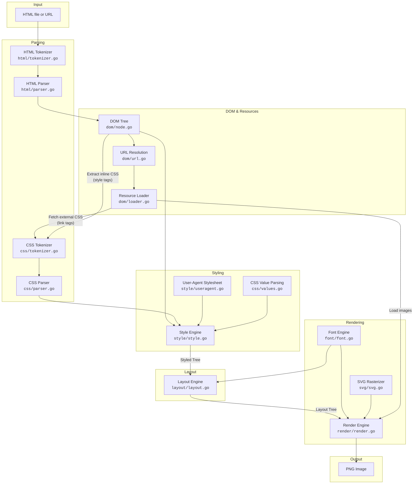

# Architecture

This document describes the high-level architecture of the browser. It is intended to help contributors orient themselves in the codebase.

## Rendering Pipeline

The browser follows a classic multi-stage rendering pipeline. Each stage transforms data from the previous stage, producing a final PNG image (or layout tree for debugging).



## Pipeline Stages

### 1. Input & Fetching

The entry point (`cmd/browser/main.go`) accepts an HTML file path or HTTP(S) URL. For URLs, content is fetched over the network. The base URL is used for resolving relative paths throughout the pipeline.

### 2. HTML Parsing → DOM Tree

**Packages:** `html/`, `dom/`

The HTML tokenizer (`html/tokenizer.go`) implements a state-machine following HTML5 §12.2.5. It produces a stream of tokens (start tags, end tags, text, comments). The parser (`html/parser.go`) consumes these tokens and builds a DOM tree of `dom.Node` structs. Each node has a type (Element, Text, Document), optional attributes, and child pointers.

### 3. CSS Parsing → Stylesheet

**Package:** `css/`

CSS is collected from two sources: inline `<style>` tags and external `<link rel="stylesheet">` tags (fetched via `dom/loader.go`). The CSS tokenizer and parser produce a `css.Stylesheet` — a list of rules, each with selectors and declarations.

### 4. Style Computation → Styled Tree

**Package:** `style/`

The style engine walks the DOM tree and, for each element, finds all matching CSS rules using selector matching (element, class, ID, descendant combinators). Rules are sorted by specificity (CSS 2.1 §6.4.3), and a `style.StyledNode` tree is produced where each node carries a `map[string]string` of computed CSS properties. A built-in user-agent stylesheet (`style/useragent.go`) provides default styles.

### 5. Layout → Layout Tree

**Package:** `layout/`

The layout engine converts the styled tree into a `layout.LayoutBox` tree with concrete pixel dimensions. It implements the CSS 2.1 box model (content, padding, border, margin), block-level layout, inline formatting with line breaking, and table layout. The font engine (`font/font.go`) provides text measurement for accurate line wrapping.

### 6. Rendering → PNG

**Package:** `render/`

The render engine traverses the layout tree and paints to an in-memory RGBA canvas: backgrounds, borders, text (using Go fonts via `golang.org/x/image`), images (PNG/JPEG/GIF loaded through `dom/loader.go`), and SVG (rasterized via `svg/`). The final image is encoded as PNG.

## Package Dependency Graph

```mermaid
flowchart BT
    dom
    html --> dom
    css
    style --> dom
    style --> css
    font
    layout --> style
    layout --> dom
    layout --> css
    layout --> font
    svg
    render --> layout
    render --> dom
    render --> css
    render --> font
    render --> svg
    log
    reftest --> render
    reftest --> layout
    reftest --> style
    reftest --> css
    reftest --> html
    reftest --> dom
    cmd_browser["cmd/browser"] --> render
    cmd_browser --> layout
    cmd_browser --> style
    cmd_browser --> css
    cmd_browser --> html
    cmd_browser --> dom
    cmd_browser --> log
    cmd_wasm["cmd/browser-wasm"] --> render
    cmd_wasm --> layout
    cmd_wasm --> style
    cmd_wasm --> css
    cmd_wasm --> html
    cmd_wasm --> dom
```

## Key Data Structures

| Stage | Structure | Description |
|-------|-----------|-------------|
| DOM | `dom.Node` | Tree node with type, tag/text data, attributes, and children |
| CSS | `css.Stylesheet` | List of `css.Rule`, each with selectors and declarations |
| Style | `style.StyledNode` | DOM node paired with a `map[string]string` of computed styles |
| Layout | `layout.LayoutBox` | Box type + `Dimensions` (content rect, padding, border, margin) + children |
| Render | `render.Canvas` | RGBA pixel buffer drawn to and saved as PNG |

## Entry Points

| Binary | Package | Description |
|--------|---------|-------------|
| `browser` | `cmd/browser/` | CLI tool — renders an HTML file or URL to PNG |
| `browser-wasm` | `cmd/browser-wasm/` | WebAssembly build — runs the browser in a web page |
| `wptrunner` | `cmd/wptrunner/` | Runs Web Platform Tests (reftests) for conformance checking |
