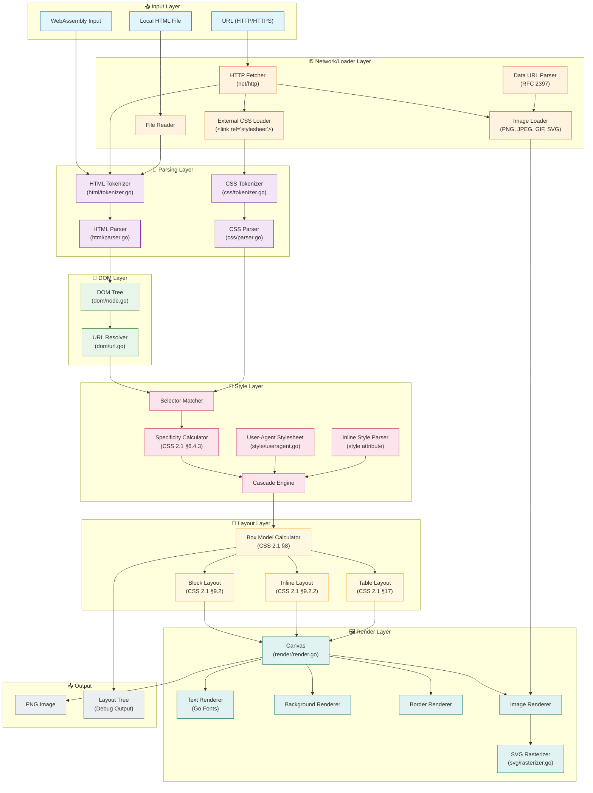
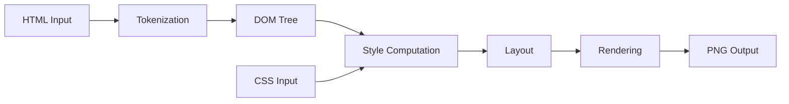
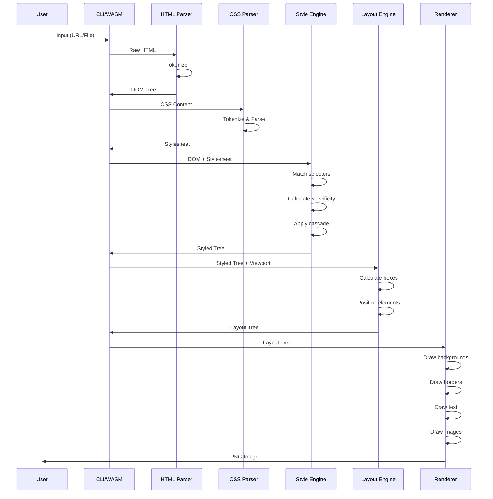
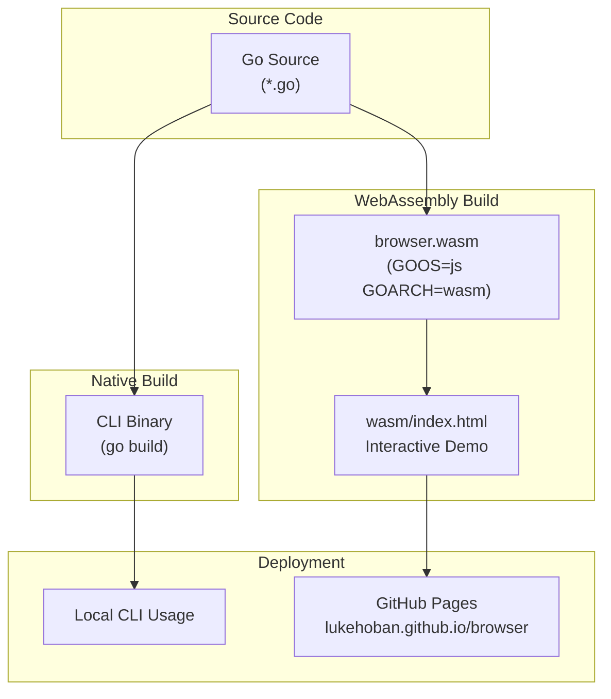

# Browser Architecture

This document describes the architecture of the Go Browser implementation.

## What Does This Repository Do?

This repository implements a **simple web browser in Go** that can:

1. **Parse HTML** documents into a DOM tree
2. **Parse CSS** stylesheets into rule sets
3. **Compute styles** by matching CSS selectors to DOM elements
4. **Calculate layout** using the CSS box model
5. **Render** the result to PNG images

The browser supports both local HTML files and remote URLs (HTTP/HTTPS), and can run natively as a CLI tool or in web browsers via WebAssembly.

## Architecture Diagram



## Rendering Pipeline

The browser follows a classic web rendering pipeline:



### Pipeline Stages

| Stage | Package | Key Files | Description |
|-------|---------|-----------|-------------|
| **1. Tokenization** | `html/` | `tokenizer.go` | Converts HTML text into tokens (start tags, end tags, text, etc.) |
| **2. Parsing** | `html/` | `parser.go` | Builds DOM tree from tokens |
| **3. CSS Parsing** | `css/` | `tokenizer.go`, `parser.go` | Parses CSS rules and selectors |
| **4. Style Computation** | `style/` | `style.go` | Matches selectors to elements, computes cascade |
| **5. Layout** | `layout/` | `layout.go` | Calculates box positions and dimensions |
| **6. Rendering** | `render/` | `render.go` | Draws to canvas, outputs PNG |

## Package Structure

```mermaid
graph TB
    subgraph cmd["cmd/"]
        browser["browser/main.go<br/>CLI Entry Point"]
        wasm["browser-wasm/main.go<br/>WASM Entry Point"]
        wptrunner["wptrunner/<br/>Test Runner"]
    end

    subgraph core["Core Packages"]
        dom["dom/<br/>DOM Tree Structure"]
        html["html/<br/>HTML Parsing"]
        css["css/<br/>CSS Parsing"]
        style["style/<br/>Style Computation"]
        layout["layout/<br/>Layout Engine"]
        render["render/<br/>Rendering"]
    end

    subgraph support["Support Packages"]
        svg["svg/<br/>SVG Parser & Rasterizer"]
        font["font/<br/>Font Embedding"]
        log["log/<br/>Logging"]
        reftest["reftest/<br/>Reference Tests"]
    end

    browser --> dom
    browser --> html
    browser --> css
    browser --> style
    browser --> layout
    browser --> render
    
    wasm --> html
    wasm --> css
    wasm --> style
    wasm --> layout
    wasm --> render

    html --> dom
    style --> dom
    style --> css
    layout --> style
    render --> layout
    render --> svg
    render --> font
```

## Data Flow



## Key Data Structures

### DOM Node (`dom/node.go`)
```go
type Node struct {
    Type       NodeType           // Document, Element, Text
    Data       string             // Tag name or text content
    Attributes map[string]string  // Element attributes
    Children   []*Node            // Child nodes
    Parent     *Node              // Parent reference
}
```

### CSS Rule (`css/parser.go`)
```go
type Rule struct {
    Selectors    []*Selector    // List of selectors
    Declarations []*Declaration // Property-value pairs
}
```

### Styled Node (`style/style.go`)
```go
type StyledNode struct {
    Node     *dom.Node              // DOM node reference
    Styles   map[string]string      // Computed styles
    Children []*StyledNode          // Styled children
}
```

### Layout Box (`layout/layout.go`)
```go
type LayoutBox struct {
    BoxType    BoxType      // Block, Inline, Table, etc.
    Dimensions Dimensions   // Position and size
    StyledNode *StyledNode  // Styled node reference
    Children   []*LayoutBox // Child boxes
}
```

## Specification Compliance

The browser implements portions of these W3C specifications:

| Specification | Coverage | Key Features |
|--------------|----------|--------------|
| **HTML5** | Partial | Tokenization, DOM tree construction, void elements |
| **CSS 2.1 §4** | Good | Syntax, tokenization, identifiers |
| **CSS 2.1 §5** | Good | Selectors (type, class, ID, descendant) |
| **CSS 2.1 §6** | Good | Cascade, specificity calculation |
| **CSS 2.1 §8** | Good | Box model (margin, padding, border) |
| **CSS 2.1 §9** | Partial | Block layout, basic inline layout |
| **CSS 2.1 §14** | Good | Colors and backgrounds |
| **CSS 2.1 §17** | Partial | Table layout (basic) |
| **RFC 2397** | Good | Data URLs (base64, URL-encoded) |

## Deployment Targets



## See Also

- [MILESTONES.md](MILESTONES.md) - Implementation progress and feature tracking
- [IMPLEMENTATION.md](IMPLEMENTATION.md) - Detailed implementation notes
- [TESTING.md](TESTING.md) - Testing strategy and results
- [README.md](README.md) - Quick start guide
