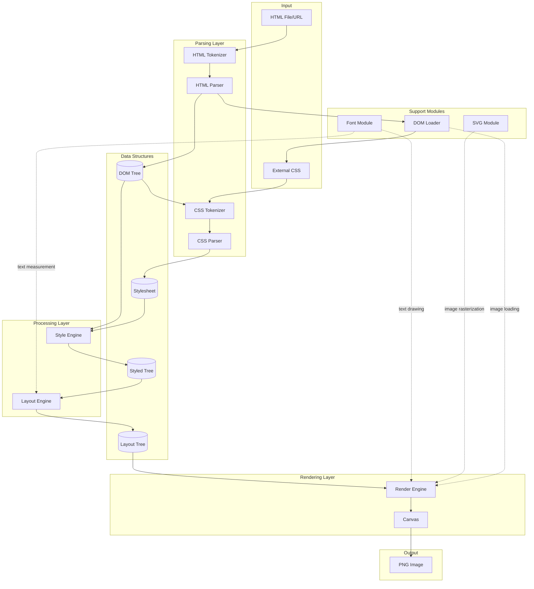
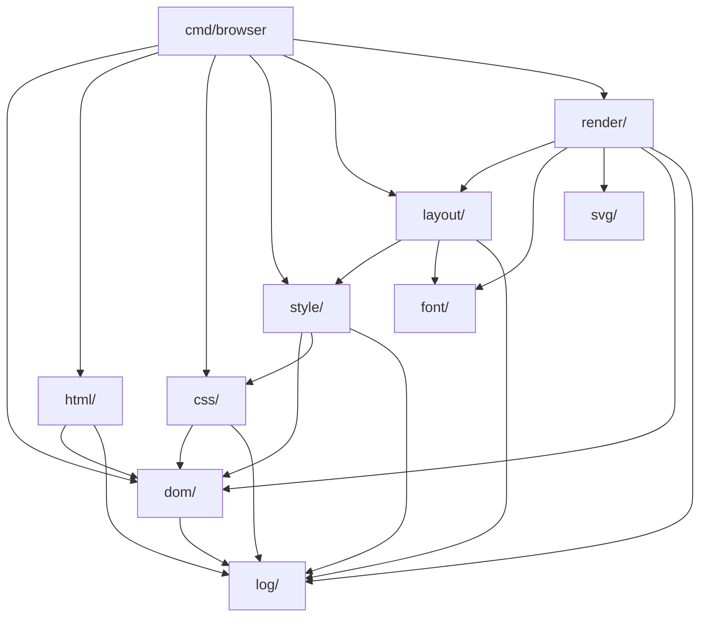
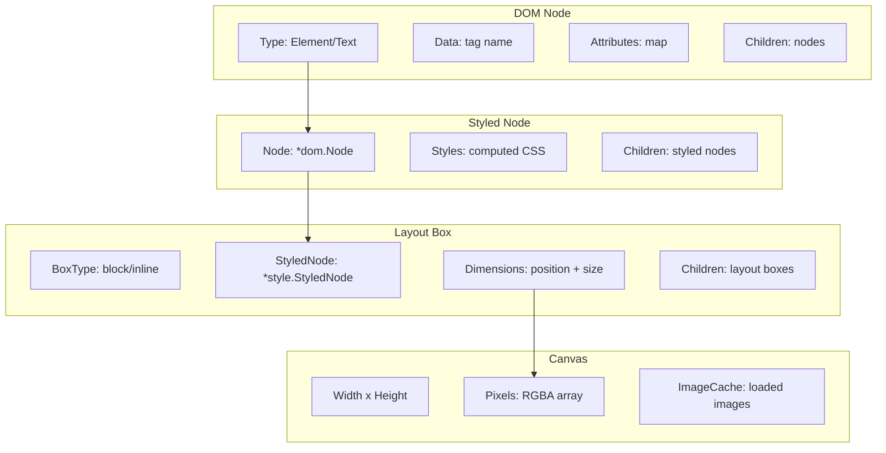
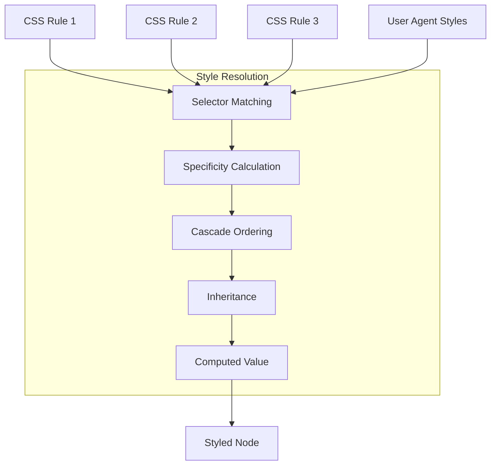
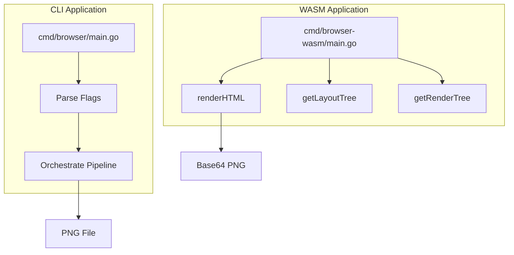

# Browser Architecture

A web browser rendering engine written in Go that converts HTML/CSS to PNG images.

## High-Level Architecture

## Rendering Pipeline

```mermaid
flowchart LR
    subgraph "1. Parse"
        A[HTML Input] --> B[Tokenize]
        B --> C[Build DOM]
    end

    subgraph "2. Style"
        C --> D[Extract CSS]
        D --> E[Parse CSS]
        E --> F[Match Selectors]
        F --> G[Compute Cascade]
    end

    subgraph "3. Layout"
        G --> H[Generate Boxes]
        H --> I[Calculate Dimensions]
        I --> J[Position Elements]
    end

    subgraph "4. Render"
        J --> K[Draw Backgrounds]
        K --> L[Draw Borders]
        L --> M[Draw Text/Images]
        M --> N[PNG Output]
    end
```

## Module Dependencies

## Data Structure Transformations

## CSS Cascade & Specificity

## Entry Points

## Key Modules Summary

| Module | Responsibility |
|--------|----------------|
| `html/` | HTML tokenization and DOM tree construction |
| `css/` | CSS tokenization and stylesheet parsing |
| `dom/` | DOM node structure, URL resolution, resource loading |
| `style/` | Selector matching, specificity, cascade, inheritance |
| `layout/` | CSS box model, dimension calculation, positioning |
| `render/` | Drawing to canvas (backgrounds, borders, text, images) |
| `font/` | TrueType font loading, text measurement |
| `svg/` | SVG parsing and rasterization |
| `log/` | Debug logging with configurable levels |
