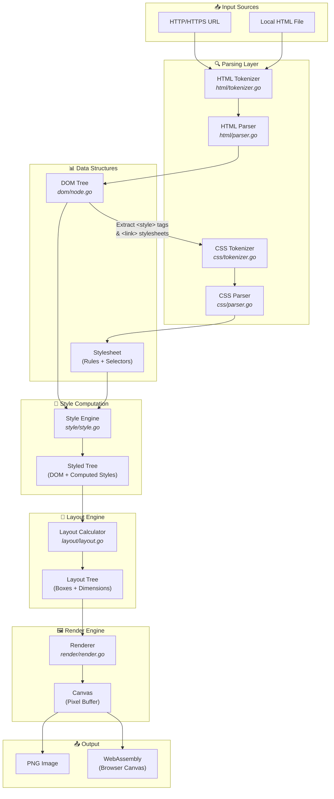
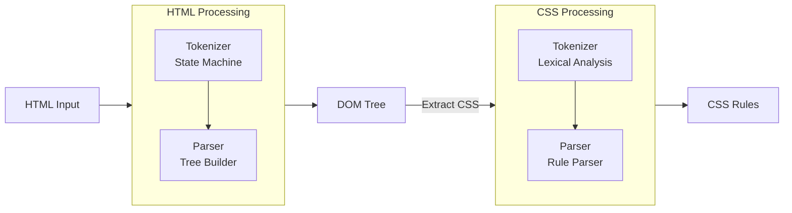
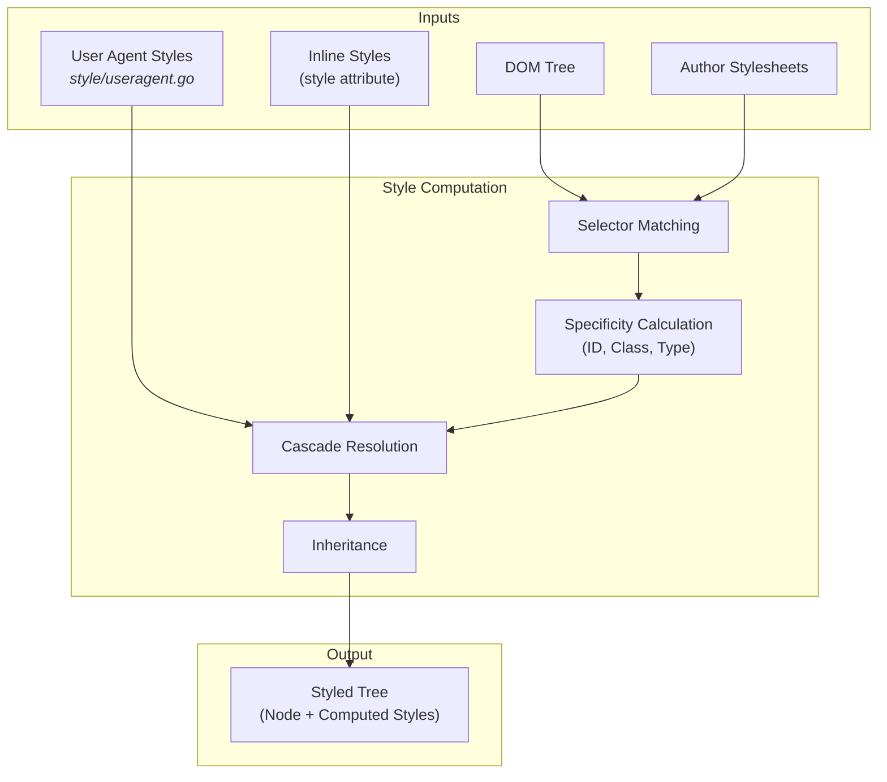
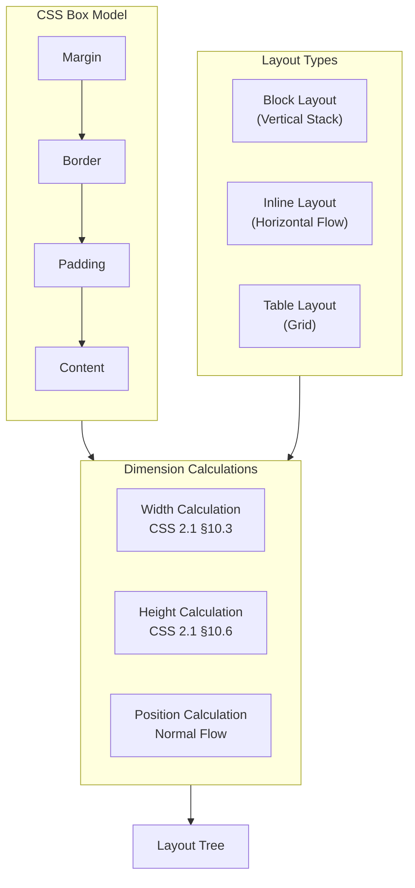
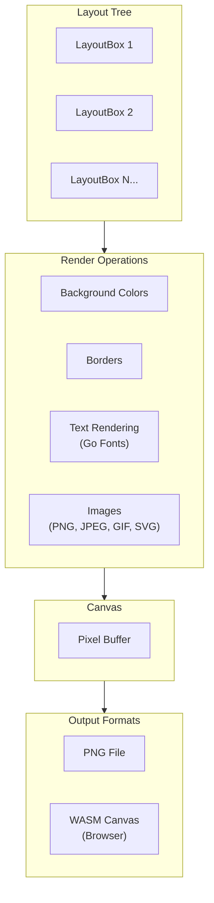
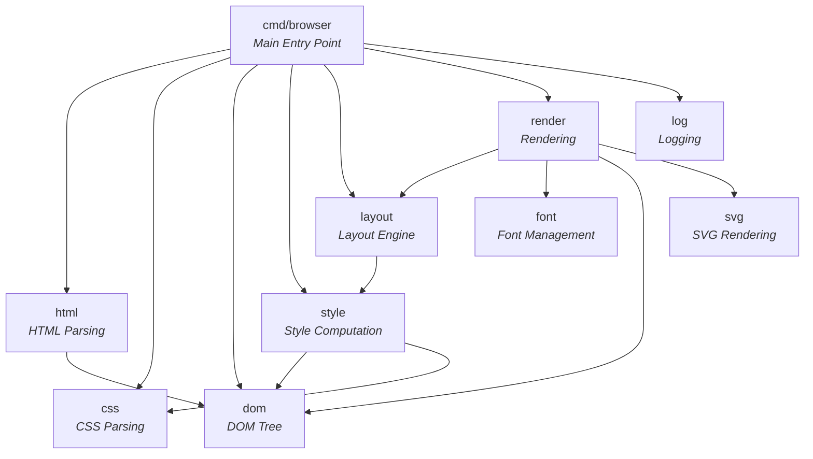

# Architecture Diagram

This document provides visual architecture diagrams for the browser implementation.

## High-Level Architecture

The browser follows a classic web rendering pipeline, transforming HTML/CSS input into rendered PNG output.

## Component Details

### Parsing Pipeline

### Style Cascade & Computation

### Box Model & Layout

### Rendering Pipeline

## Package Dependencies

## Data Flow Summary

| Stage | Input | Output | Key Files |
|-------|-------|--------|-----------|
| **1. Fetch** | URL or File Path | HTML String | `cmd/browser/main.go` |
| **2. HTML Parse** | HTML String | DOM Tree | `html/tokenizer.go`, `html/parser.go` |
| **3. CSS Parse** | CSS String | Stylesheet | `css/tokenizer.go`, `css/parser.go` |
| **4. Style** | DOM + Stylesheet | Styled Tree | `style/style.go` |
| **5. Layout** | Styled Tree | Layout Tree | `layout/layout.go` |
| **6. Render** | Layout Tree | PNG Image | `render/render.go` |

## Specifications Implemented

- **HTML5** - Tokenization and parsing (§12)
- **CSS 2.1** - Syntax, selectors, cascade, box model, visual formatting
- **RFC 2397** - Data URL scheme
