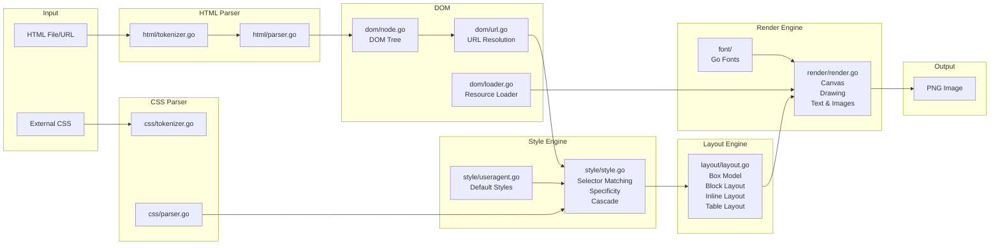
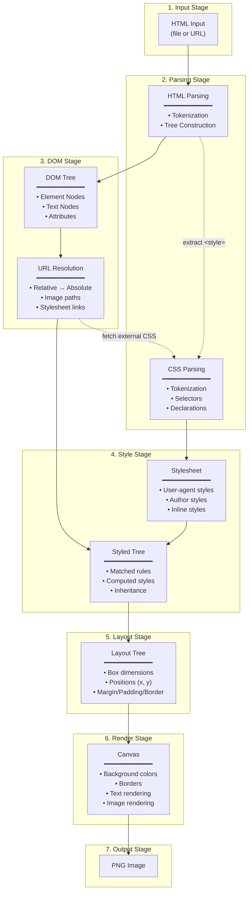
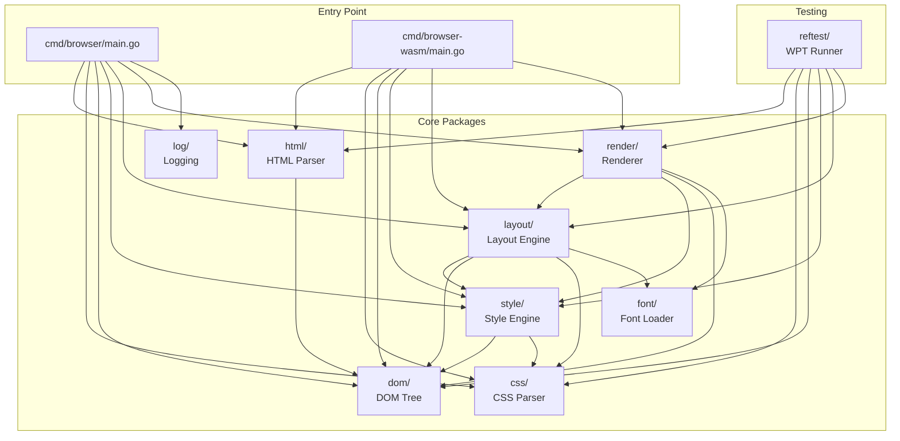
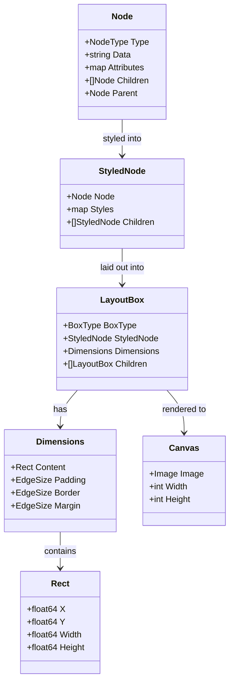
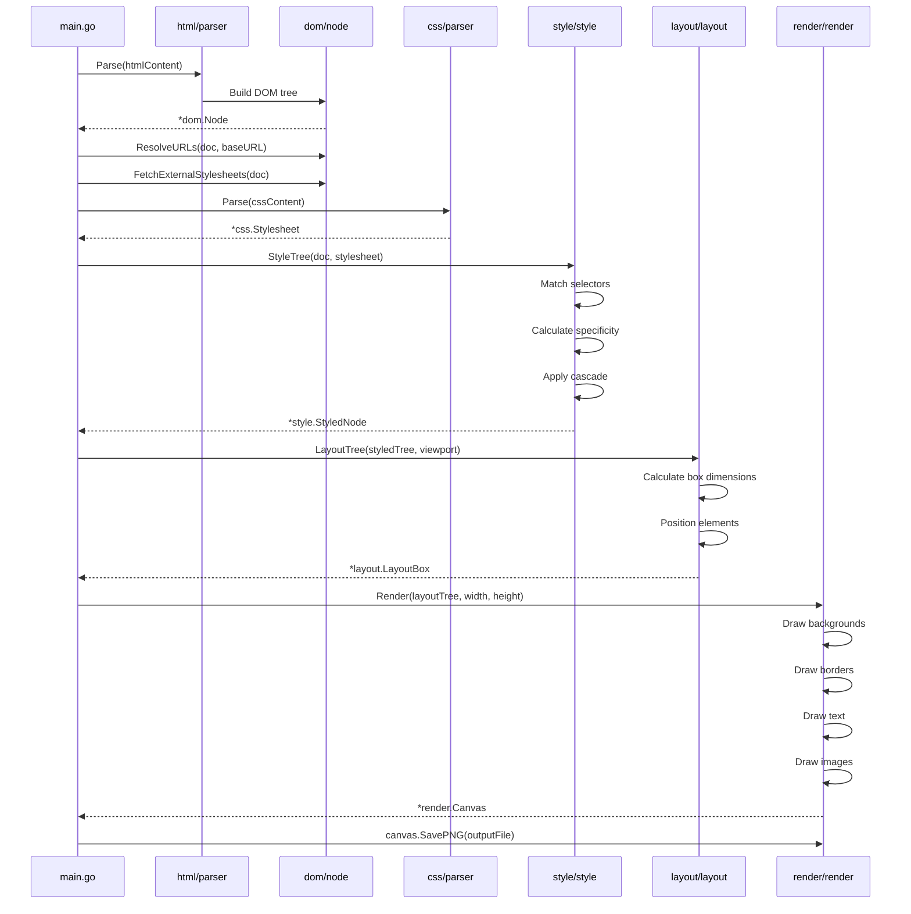
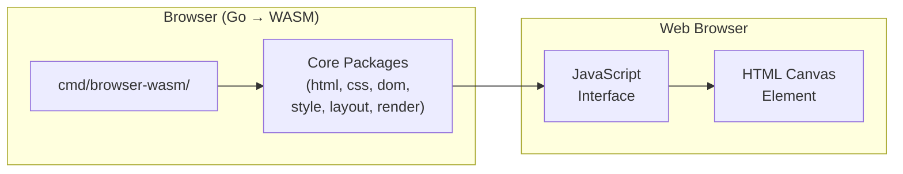

# Architecture Diagram

This document provides a visual overview of the browser's architecture.

## What Does This Browser Do?

This is an **educational web browser implementation in Go** that:

1. **Parses HTML** documents into a DOM tree
2. **Parses CSS** stylesheets (inline and external)
3. **Computes styles** by matching CSS selectors to DOM elements
4. **Calculates layout** using the CSS box model
5. **Renders** the final output to a PNG image

It follows W3C specifications (HTML5 and CSS 2.1) and demonstrates fundamental web rendering concepts.

## High-Level Rendering Pipeline

## Data Flow Diagram

## Package Dependencies

## Key Data Structures

## Processing Steps

## Feature Summary

| Component | Features Implemented | Not Yet Implemented |
|-----------|---------------------|---------------------|
| **HTML Parser** | Tokenization, tree construction, void elements, attributes | Character references, namespaces, script execution |
| **CSS Parser** | Selectors (element, class, ID), descendant combinators, declarations | Pseudo-classes, pseudo-elements, attribute selectors |
| **Style Engine** | Selector matching, specificity, cascade, inheritance | !important, computed values |
| **Layout Engine** | Box model, block layout, inline layout, tables | Floats, positioning, flexbox, grid |
| **Render Engine** | Backgrounds, borders, text, images, SVG | Background images (CSS), gradients, transforms |

## WebAssembly Support

The browser can also run in a web browser via WebAssembly:

Live demo: https://lukehoban.github.io/browser/
