# Architecture Documentation

This document provides detailed architecture diagrams for the browser implementation.

## High-Level Architecture

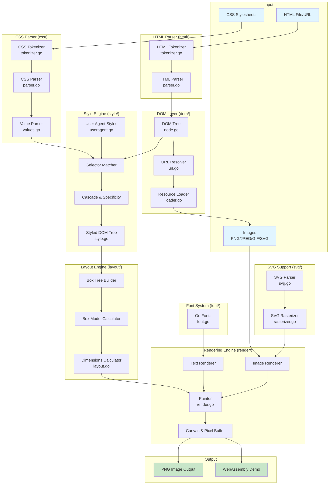

## Rendering Pipeline

```mermaid
flowchart LR
    subgraph "1. Parse"
        A[HTML Input] --> B[Tokenizer]
        B --> C[Parser]
        C --> D[DOM Tree]
    end
    
    subgraph "2. Style"
        D --> E[CSS Parser]
        E --> F[Selector Matching]
        F --> G[Cascade]
        G --> H[Styled Tree]
    end
    
    subgraph "3. Layout"
        H --> I[Box Tree]
        I --> J[Calculate Dimensions]
        J --> K[Position Elements]
    end
    
    subgraph "4. Render"
        K --> L[Draw Backgrounds]
        L --> M[Draw Borders]
        M --> N[Draw Text]
        N --> O[Draw Images]
        O --> P[PNG Output]
    end
    
    style A fill:#e1f5ff
    style P fill:#c8e6c9
```

## Data Structures Flow

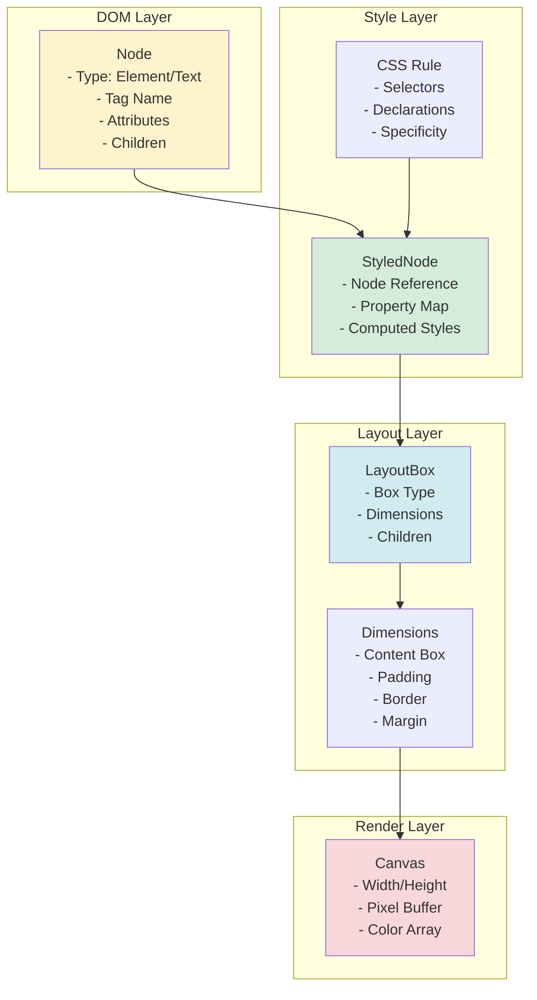

## CSS Box Model Implementation

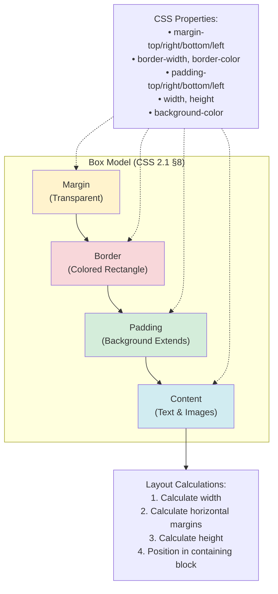

## Module Dependencies

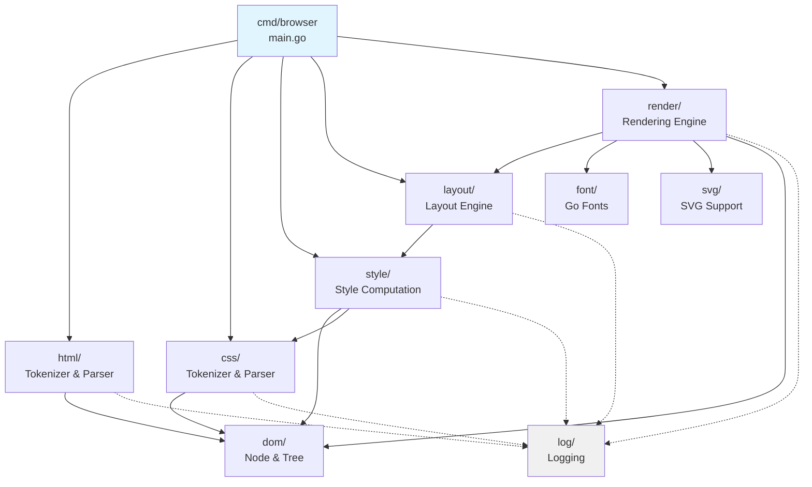

## Network & Resource Loading

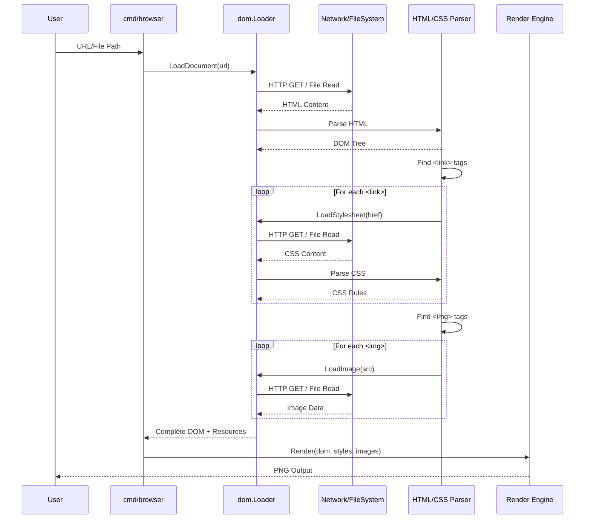

## WebAssembly Architecture

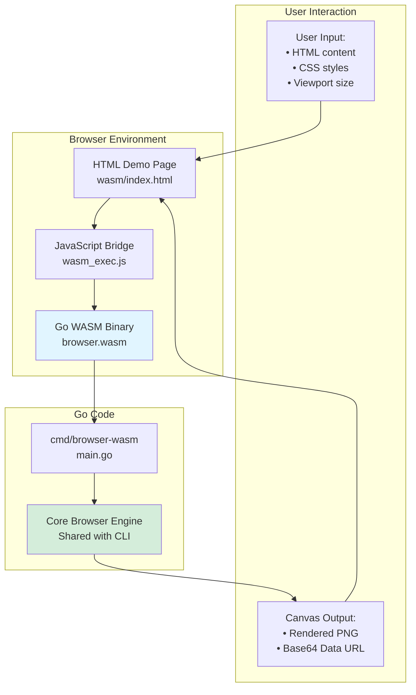

## Selector Matching Algorithm

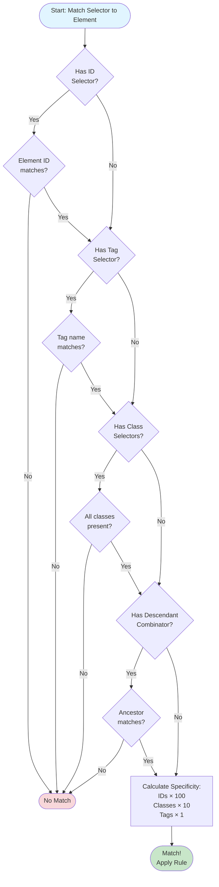

## Color & Font Rendering

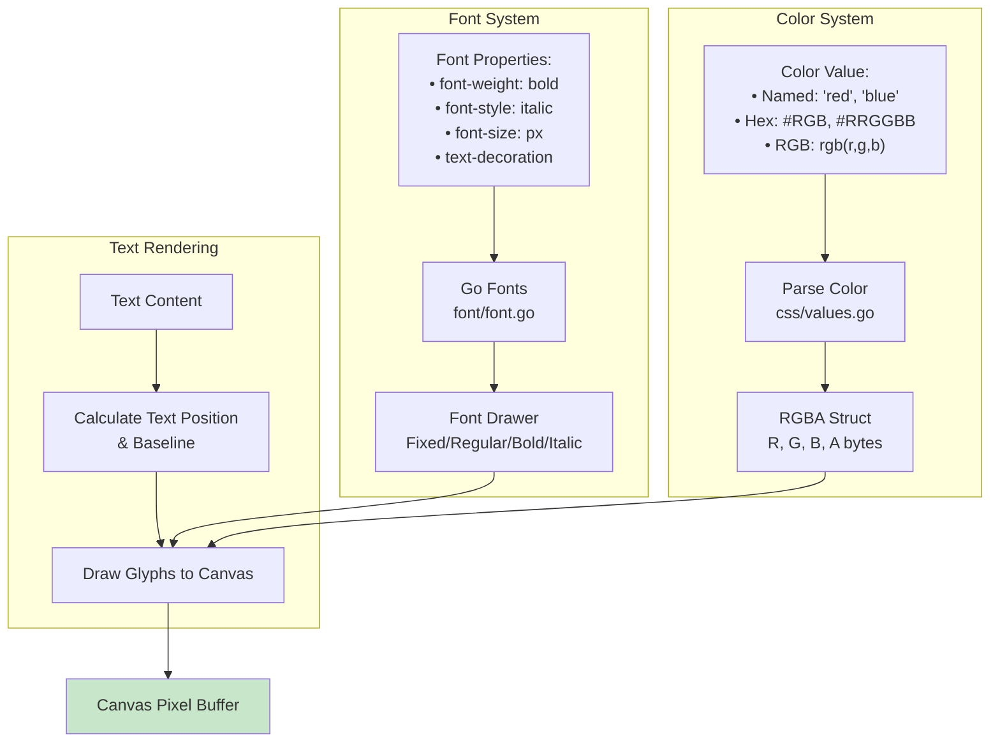

## Image Support Architecture

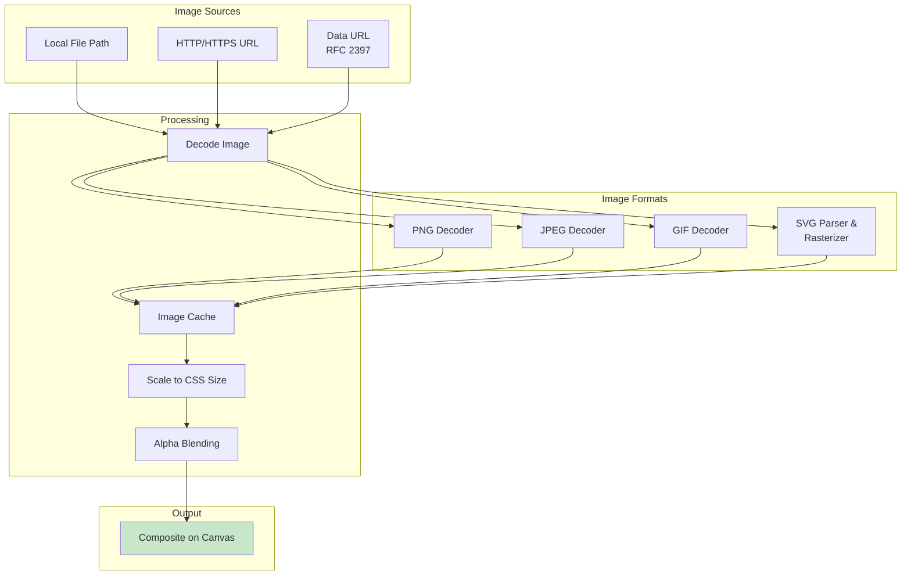

## Testing Architecture

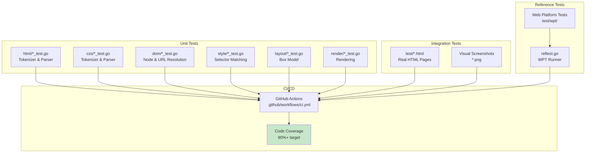

## Key Design Patterns

### 1. Pipeline Pattern
The browser uses a sequential pipeline where each stage transforms data and passes it to the next stage:
- **HTML** → **DOM** → **Styled Tree** → **Layout Tree** → **Canvas** → **PNG**

### 2. Visitor Pattern
The style matching algorithm walks the DOM tree and applies CSS rules to each node.

### 3. Composite Pattern
Both DOM and Layout trees use composite pattern where nodes can contain children.

### 4. Strategy Pattern
Different rendering strategies for different element types (block vs inline, text vs image).

### 5. Cache Pattern
Images and fonts are cached to avoid redundant loading and parsing.

## Performance Characteristics

| Component | Time Complexity | Space Complexity | Notes |
|-----------|----------------|------------------|-------|
| HTML Parsing | O(n) | O(n) | n = input size |
| CSS Parsing | O(m) | O(m) | m = stylesheet size |
| Style Matching | O(n × r) | O(n) | n = DOM nodes, r = CSS rules |
| Layout Calculation | O(n) | O(n) | Single-pass tree traversal |
| Rendering | O(p) | O(w × h) | p = pixels, w×h = canvas size |

## Specification Compliance Matrix

| Specification | Status | Coverage |
|--------------|--------|----------|
| HTML5 §12.2 Tokenization | ✅ Partial | Common states implemented |
| HTML5 §12.2 Tree Construction | ✅ Simplified | Basic algorithm implemented |
| CSS 2.1 §4 Syntax | ✅ Complete | Full tokenization |
| CSS 2.1 §5 Selectors | ✅ Partial | Element, class, ID, descendant |
| CSS 2.1 §6 Cascade | ✅ Partial | Specificity only |
| CSS 2.1 §8 Box Model | ✅ Complete | Full implementation |
| CSS 2.1 §9 Visual Formatting | ✅ Partial | Block layout only |
| CSS 2.1 §10 Width/Height | ✅ Complete | Auto and fixed values |
| CSS 2.1 §14 Colors/Backgrounds | ✅ Complete | Colors and backgrounds |
| RFC 2397 Data URLs | ✅ Complete | Base64 and percent-encoded |

## Future Architecture Considerations

### Potential Extensions
1. **Inline Layout**: Full inline formatting context with text wrapping
2. **Floats**: CSS float positioning
3. **Flexbox**: CSS Flexible Box Layout Module
4. **Grid**: CSS Grid Layout Module
5. **JavaScript Engine**: JS execution and DOM manipulation
6. **Incremental Rendering**: Progressive display during loading
7. **GPU Acceleration**: Hardware-accelerated rendering

### Scalability Improvements
1. **Parallel Parsing**: Multi-threaded HTML/CSS parsing
2. **Layout Optimization**: Incremental layout invalidation
3. **Render Layers**: Compositor with layer trees
4. **Smart Caching**: Persistent cache across renders

## References

- **HTML5 Specification**: https://html.spec.whatwg.org/
- **CSS 2.1 Specification**: https://www.w3.org/TR/CSS21/
- **RFC 2397 (Data URLs)**: https://datatracker.ietf.org/doc/html/rfc2397
- **Web Platform Tests**: https://github.com/web-platform-tests/wpt
- **Go Fonts**: https://go.googlesource.com/image/+/refs/heads/master/font/gofont/
