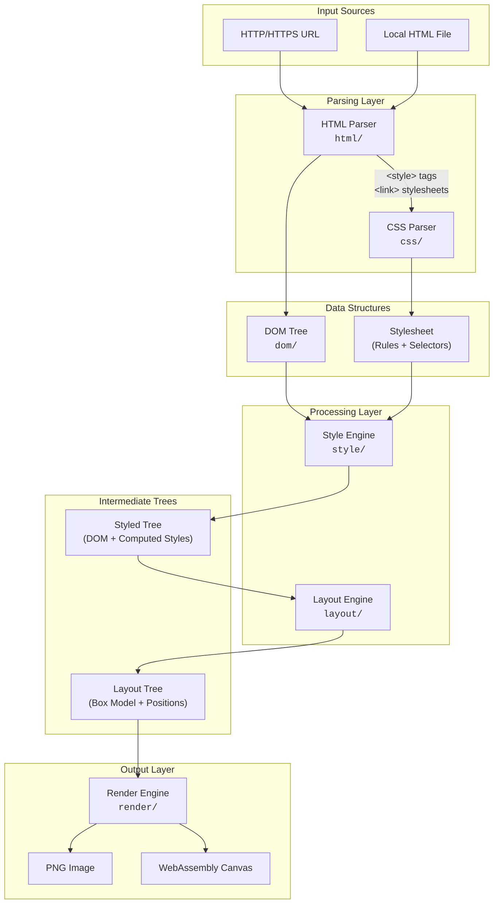
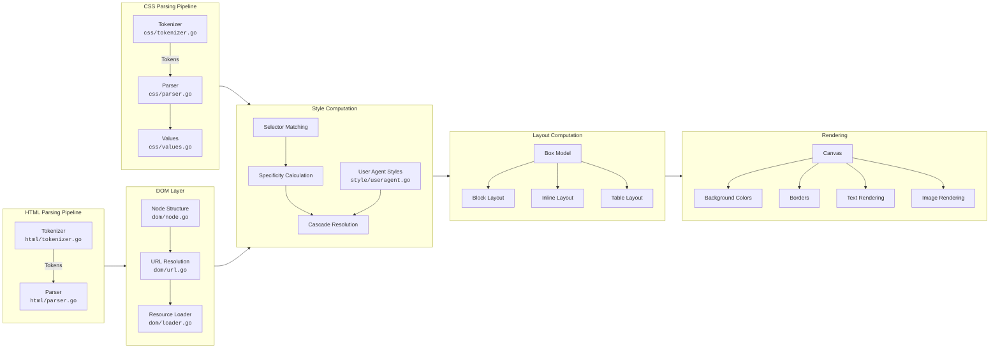
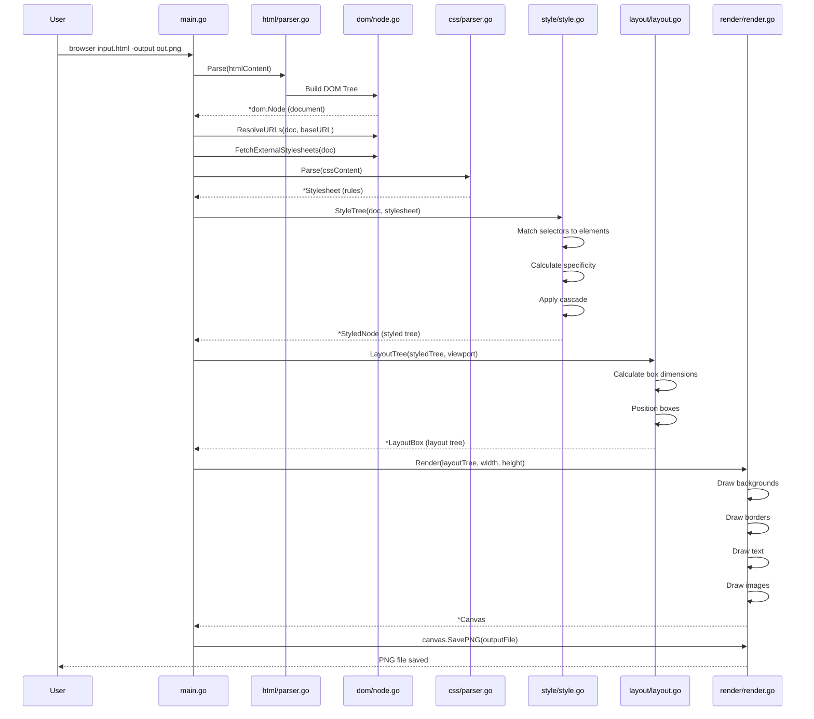
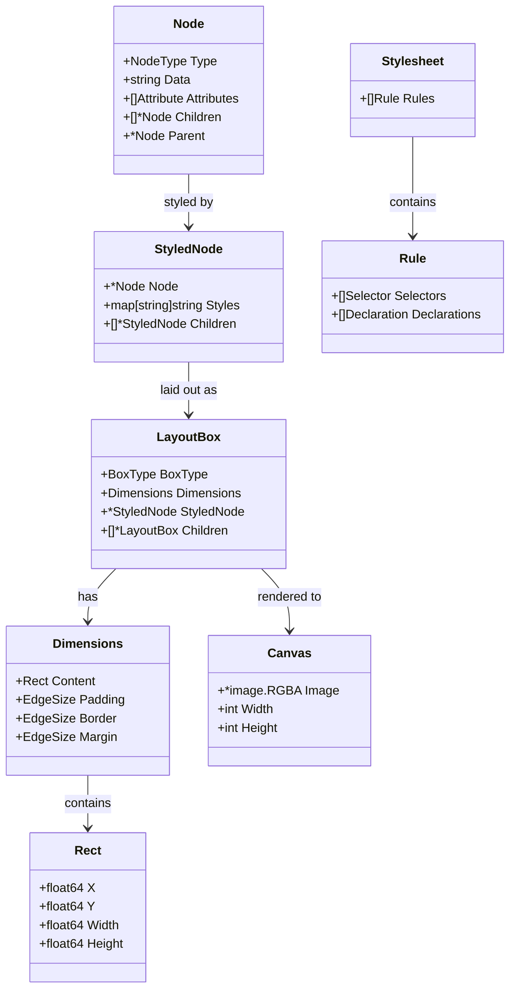
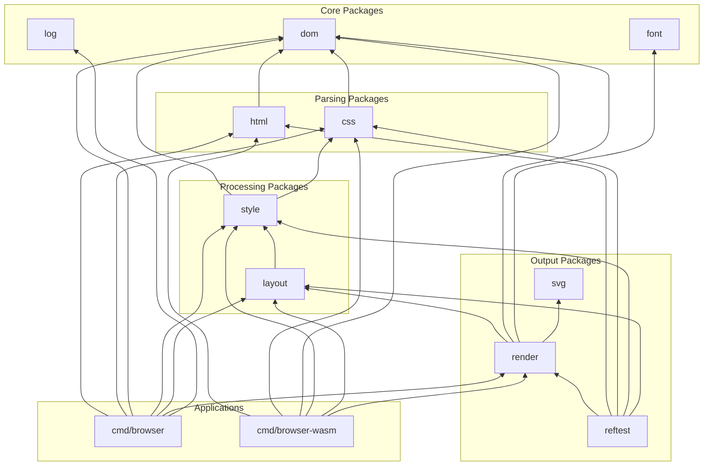
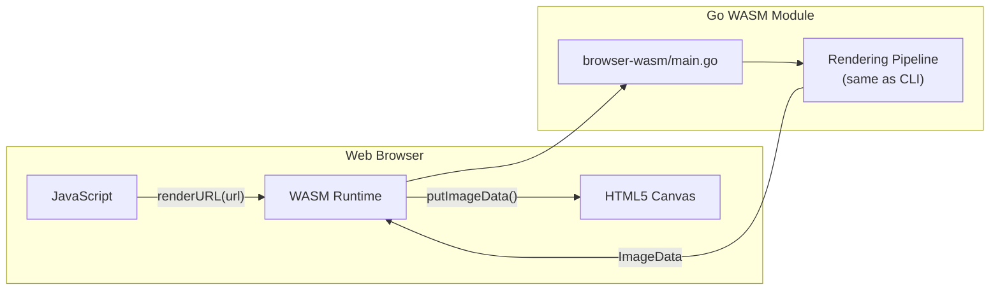

# Browser Architecture

This document provides a visual overview of the browser's architecture and rendering pipeline.

## High-Level Architecture

## Detailed Component Architecture

## Data Flow Diagram

## Key Data Structures

## Module Dependencies

## Rendering Pipeline Summary

| Stage | Input | Output | Key Files |
|-------|-------|--------|-----------|
| **1. Fetch** | URL or file path | HTML string | `cmd/browser/main.go` |
| **2. Parse HTML** | HTML string | DOM tree | `html/tokenizer.go`, `html/parser.go` |
| **3. Parse CSS** | CSS string | Stylesheet | `css/tokenizer.go`, `css/parser.go` |
| **4. Style** | DOM + Stylesheet | Styled tree | `style/style.go` |
| **5. Layout** | Styled tree + viewport | Layout tree | `layout/layout.go` |
| **6. Render** | Layout tree | PNG image | `render/render.go` |

## WebAssembly Architecture

## What This Browser Does

This is a **simple, educational web browser** written in Go that:

1. **Parses HTML** into a DOM tree following HTML5 tokenization specifications
2. **Parses CSS** stylesheets (inline `<style>` tags and external `<link>` stylesheets)
3. **Computes styles** by matching CSS selectors to DOM elements with proper specificity
4. **Calculates layout** using the CSS 2.1 box model and visual formatting model
5. **Renders** the final result to a PNG image

### Supported Features

- ✅ Block and inline layout
- ✅ CSS box model (margin, padding, border)
- ✅ Colors (named, hex)
- ✅ Fonts (Go fonts with bold, italic, size)
- ✅ Images (PNG, JPEG, GIF, SVG)
- ✅ Network fetching (HTTP/HTTPS)
- ✅ Data URLs (RFC 2397)
- ✅ WebAssembly compilation

### Not Supported

- ❌ JavaScript execution
- ❌ CSS floats and positioning
- ❌ CSS animations/transitions
- ❌ Web APIs (fetch, localStorage, etc.)
- ❌ User interaction (clicking, typing)

This browser is designed for **educational purposes** to demonstrate how web browsers work internally, following W3C specifications closely.
