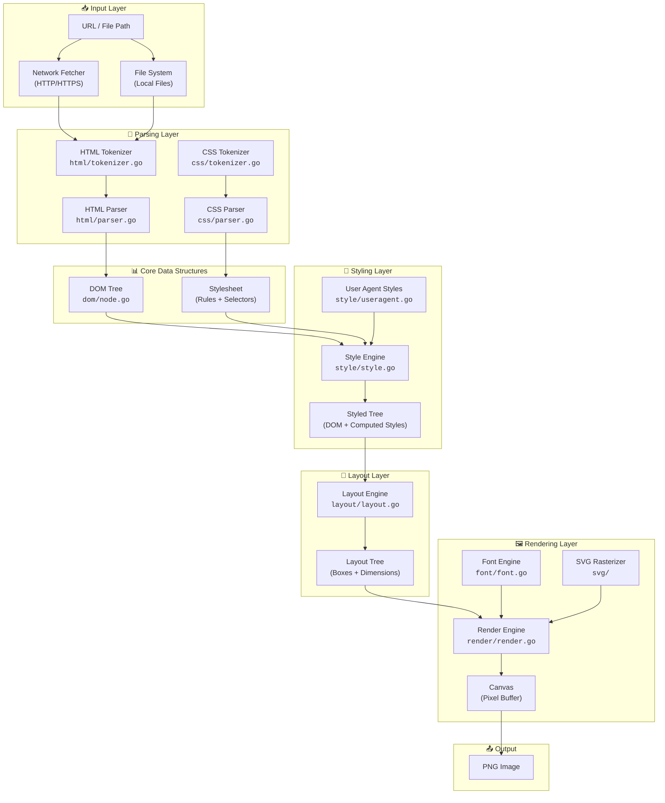
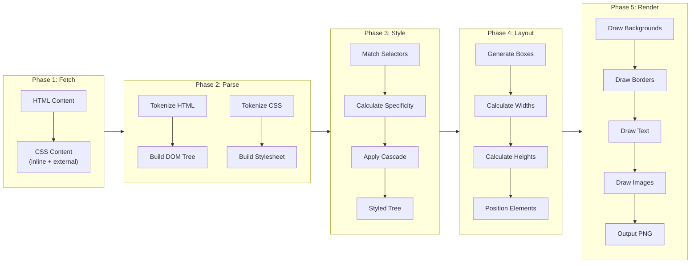
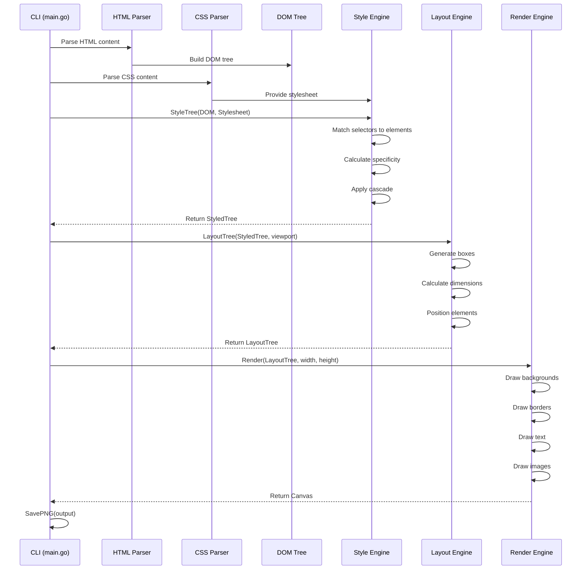

# Architecture

This document describes the architecture of the browser project - a web browser implementation in Go that parses HTML and CSS, computes styles, calculates layout, and renders to PNG images.

## High-Level Overview

The browser follows a classic rendering pipeline, transforming HTML/CSS input into visual output:

```
┌─────────────────────────────────────────────────────────────────────────────────┐
│                              BROWSER RENDERING PIPELINE                          │
└─────────────────────────────────────────────────────────────────────────────────┘

┌──────────────┐    ┌──────────────┐    ┌──────────────┐    ┌──────────────┐    ┌──────────────┐
│    INPUT     │    │   PARSING    │    │    STYLE     │    │    LAYOUT    │    │   RENDER     │
│              │───▶│              │───▶│              │───▶│              │───▶│              │
│  HTML + CSS  │    │  DOM + CSSOM │    │  Styled Tree │    │  Layout Tree │    │  PNG Output  │
└──────────────┘    └──────────────┘    └──────────────┘    └──────────────┘    └──────────────┘
```

## Component Diagram



## Data Flow



## Module Dependencies

```mermaid
graph BT
    cmd["cmd/browser<br/>(CLI Entry Point)"]
    
    render["render<br/>(Drawing)"]
    layout["layout<br/>(Box Model)"]
    style["style<br/>(Cascade)"]
    css["css<br/>(CSS Parsing)"]
    html["html<br/>(HTML Parsing)"]
    dom["dom<br/>(Data Structure)"]
    font["font<br/>(Typography)"]
    svg["svg<br/>(Vector Graphics)"]
    log["log<br/>(Logging)"]
    
    cmd --> render
    cmd --> layout
    cmd --> style
    cmd --> css
    cmd --> html
    cmd --> dom
    cmd --> log
    
    render --> layout
    render --> font
    render --> svg
    render --> dom
    
    layout --> style
    layout --> dom
    
    style --> css
    style --> dom
    
    html --> dom
```

## Key Data Structures

### DOM Node (`dom/node.go`)

```
┌─────────────────────────────────────────────┐
│                  Node                        │
├─────────────────────────────────────────────┤
│  Type: NodeType (Document/Element/Text)     │
│  Data: string (tag name or text content)    │
│  Attributes: map[string]string              │
│  Children: []*Node                          │
│  Parent: *Node                              │
└─────────────────────────────────────────────┘
```

### Stylesheet (`css/parser.go`)

```
┌─────────────────────────────────────────────┐
│               Stylesheet                     │
├─────────────────────────────────────────────┤
│  Rules: []Rule                              │
│    ├── Selectors: []Selector                │
│    │     ├── Tag: string                    │
│    │     ├── ID: string                     │
│    │     ├── Classes: []string              │
│    │     └── Combinators: []Combinator      │
│    └── Declarations: []Declaration          │
│          ├── Property: string               │
│          └── Value: string                  │
└─────────────────────────────────────────────┘
```

### Styled Node (`style/style.go`)

```
┌─────────────────────────────────────────────┐
│              StyledNode                      │
├─────────────────────────────────────────────┤
│  Node: *dom.Node                            │
│  Styles: map[string]string                  │
│  Children: []*StyledNode                    │
└─────────────────────────────────────────────┘
```

### Layout Box (`layout/layout.go`)

```
┌─────────────────────────────────────────────┐
│               LayoutBox                      │
├─────────────────────────────────────────────┤
│  BoxType: BoxType (Block/Inline/Anonymous)  │
│  Dimensions: Dimensions                     │
│    ├── Content: Rect (x, y, width, height)  │
│    ├── Padding: EdgeSize (t, r, b, l)       │
│    ├── Border: EdgeSize (t, r, b, l)        │
│    └── Margin: EdgeSize (t, r, b, l)        │
│  StyledNode: *StyledNode                    │
│  Children: []*LayoutBox                     │
└─────────────────────────────────────────────┘
```

## CSS Box Model

```
┌───────────────────────────────────────────────────────────────┐
│                         MARGIN                                 │
│   ┌───────────────────────────────────────────────────────┐   │
│   │                       BORDER                           │   │
│   │   ┌───────────────────────────────────────────────┐   │   │
│   │   │                   PADDING                      │   │   │
│   │   │   ┌───────────────────────────────────────┐   │   │   │
│   │   │   │                                       │   │   │   │
│   │   │   │              CONTENT                  │   │   │   │
│   │   │   │         (width × height)              │   │   │   │
│   │   │   │                                       │   │   │   │
│   │   │   └───────────────────────────────────────┘   │   │   │
│   │   │                                               │   │   │
│   │   └───────────────────────────────────────────────┘   │   │
│   │                                                       │   │
│   └───────────────────────────────────────────────────────┘   │
│                                                               │
└───────────────────────────────────────────────────────────────┘
```

## Rendering Pipeline Detail



## Directory Structure

```
browser/
├── cmd/
│   ├── browser/           # Main CLI application
│   │   └── main.go        # Entry point, orchestrates pipeline
│   └── browser-wasm/      # WebAssembly entry point
│       └── main.go        # WASM-specific initialization
│
├── html/                  # HTML Parsing (HTML5 §12)
│   ├── tokenizer.go       # State machine tokenizer
│   └── parser.go          # Tree construction algorithm
│
├── css/                   # CSS Parsing (CSS 2.1 §4)
│   ├── tokenizer.go       # CSS token generation
│   ├── parser.go          # Selector & declaration parsing
│   └── values.go          # CSS value parsing utilities
│
├── dom/                   # DOM Data Structure
│   ├── node.go            # Node type definitions
│   ├── url.go             # URL resolution (HTML5 §2.5)
│   └── loader.go          # External resource loading
│
├── style/                 # Style Computation (CSS 2.1 §6)
│   ├── style.go           # Selector matching, specificity, cascade
│   └── useragent.go       # Default browser styles
│
├── layout/                # Layout Engine (CSS 2.1 §8-10)
│   └── layout.go          # Box model, dimensions, positioning
│
├── render/                # Rendering Engine (CSS 2.1 §14-16)
│   └── render.go          # Canvas, drawing operations, PNG output
│
├── font/                  # Font Engine
│   └── font.go            # Go fonts integration, text measurement
│
├── svg/                   # SVG Support
│   ├── svg.go             # SVG parsing
│   └── rasterizer.go      # SVG to raster conversion
│
├── log/                   # Logging
│   └── log.go             # Configurable logging levels
│
├── reftest/               # Reference Testing
│   └── reftest.go         # WPT reftest harness
│
├── wasm/                  # WebAssembly Demo
│   ├── index.html         # Demo page
│   └── README.md          # WASM documentation
│
└── test/                  # Test Files
    ├── simple.html        # Basic HTML test
    ├── styled.html        # CSS styling test
    └── hackernews.html    # Complex layout test
```

## Supported Features

| Component | Feature | Status |
|-----------|---------|--------|
| **HTML** | Tokenization | ✅ |
| | Tree construction | ✅ |
| | Void elements | ✅ |
| | Attributes | ✅ |
| **CSS** | Selectors (element, class, ID) | ✅ |
| | Descendant combinator | ✅ |
| | Specificity | ✅ |
| | Cascade | ✅ |
| **Layout** | Block layout | ✅ |
| | Box model | ✅ |
| | Auto/fixed/% widths | ✅ |
| | Tables (basic) | ✅ |
| **Render** | Backgrounds | ✅ |
| | Borders | ✅ |
| | Text (Go fonts) | ✅ |
| | Images (PNG/JPEG/GIF/SVG) | ✅ |
| **Network** | HTTP/HTTPS | ✅ |
| | External stylesheets | ✅ |
| | Data URLs | ✅ |
| **Output** | PNG | ✅ |
| | WebAssembly | ✅ |

## W3C Specification References

- **HTML5**: [Parsing](https://html.spec.whatwg.org/multipage/parsing.html) (§12)
- **CSS 2.1**: [Syntax](https://www.w3.org/TR/CSS21/syndata.html) (§4)
- **CSS 2.1**: [Selectors](https://www.w3.org/TR/CSS21/selector.html) (§5)
- **CSS 2.1**: [Cascade](https://www.w3.org/TR/CSS21/cascade.html) (§6)
- **CSS 2.1**: [Box Model](https://www.w3.org/TR/CSS21/box.html) (§8)
- **CSS 2.1**: [Visual Formatting](https://www.w3.org/TR/CSS21/visuren.html) (§9)
- **RFC 2397**: [Data URLs](https://datatracker.ietf.org/doc/html/rfc2397)
