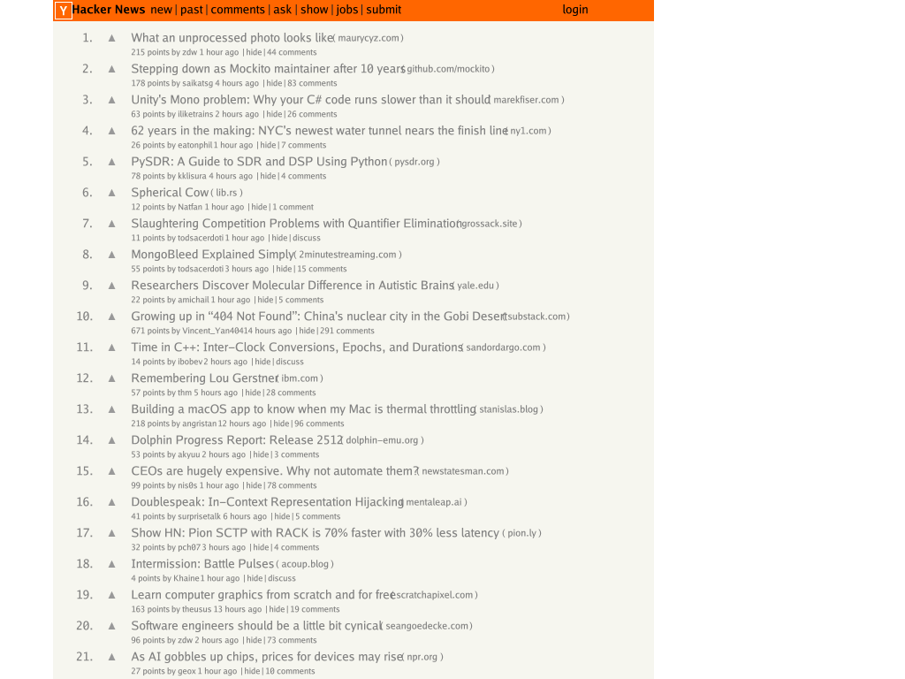

Rendering was showing significant aliasing artifacts, particularly on text edges and diagonal lines. This PR adds 4x supersampling: render at 4x the requested resolution, then downsample using box filtering.

## Implementation

- **Modified `Render()`**: Creates canvas at 4x resolution (e.g., 3200x2400 for 800x600 request), scales layout tree dimensions, then downsamples to target size
- **Added `scaleLayoutBox()`**: Recursively scales all layout dimensions (coordinates, borders, padding, margins) by supersample factor
- **Added `downsampleCanvas()`**: Box filtering that averages 4x4 pixel blocks including alpha channel, with correct pixel counting at boundaries
- **Font scaling**: Creates scaled copy of font style to match high-resolution rendering without mutating original

```go
// Render at 4x, downsample to requested size
const supersampleFactor = 4
canvas := NewCanvas(width * supersampleFactor, height * supersampleFactor)
canvas.ScaleFactor = float64(supersampleFactor)
scaledRoot := scaleLayoutBox(root, supersampleFactor)
renderLayoutBox(canvas, scaledRoot)
return downsampleCanvas(canvas, width, height, supersampleFactor)
```

## Visual Impact

Text edges are noticeably smoother and diagonal lines show reduced jaggedness. Memory usage increases 16x during rendering, proportional rendering time increase.

### Hacker News Homepage with 4x Supersampling

The following shows Hacker News rendered at 1024x768 with 4x supersampling (rendered internally at 4096x3072, then downsampled):



The antialiasing significantly improves text readability and reduces artifacts on the table borders and UI elements.
