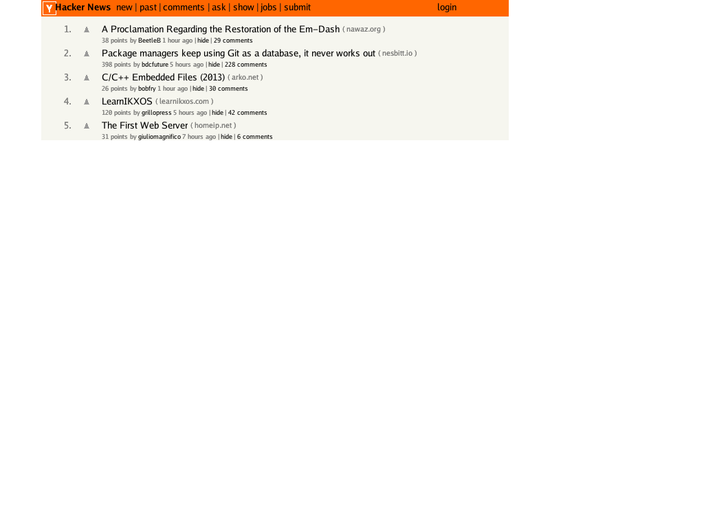

# Browser - A Simple Web Browser in Go

[](https://github.com/lukehoban/browser/actions/workflows/ci.yml)
[](https://goreportcard.com/report/github.com/lukehoban/browser)

A simple web browser implementation in Go, focusing on static HTML and CSS 2.1 compliance. This project aims to stay close to W3C specifications and provide a clean, well-organized codebase for educational purposes.

## Features

- HTML parsing with DOM tree construction
- CSS 2.1 parsing and style computation
- Visual formatting model (box model, block layout)
- Text rendering with color support
- Image rendering (PNG, JPEG, GIF support)
- Background and border rendering
- PNG image output
- **Network support**: Load pages via HTTP/HTTPS
- **External CSS**: Fetch and apply stylesheets from `<link>` tags
- **Network images**: Load images from remote URLs
- **WebAssembly**: Run the browser entirely in a web client

## Project Structure

```
browser/
├── cmd/
│   ├── browser/      # Main CLI browser application
│   └── browser-wasm/ # WebAssembly entry point
├── html/            # HTML tokenization and parsing
├── css/             # CSS parsing
├── dom/             # DOM tree structure
├── style/           # Style computation and cascade
├── layout/          # Layout engine (visual formatting model)
├── render/          # Rendering engine
├── wasm/            # WebAssembly demo page
└── test/            # Test files and fixtures
```

## Specifications

This browser implementation follows these W3C specifications:

- **HTML5**: Tokenization and parsing ([HTML5 §12](https://html.spec.whatwg.org/multipage/parsing.html))
- **CSS 2.1**: Syntax, selectors, cascade, box model, and visual formatting
  - [CSS 2.1 §4 Syntax](https://www.w3.org/TR/CSS21/syndata.html)
  - [CSS 2.1 §5 Selectors](https://www.w3.org/TR/CSS21/selector.html)
  - [CSS 2.1 §6 Cascade](https://www.w3.org/TR/CSS21/cascade.html)
  - [CSS 2.1 §8 Box Model](https://www.w3.org/TR/CSS21/box.html)
  - [CSS 2.1 §9 Visual Formatting Model](https://www.w3.org/TR/CSS21/visuren.html)

## Quick Start

### Building

```bash
go build ./cmd/browser
```

### Running

```bash
# Render local HTML file to PNG
./browser -output output.png test/styled.html

# Load and render a web page from URL
./browser -output hn.png https://news.ycombinator.com/

# View layout tree without rendering (text output)
./browser test/styled.html

# Custom viewport size
./browser -output output.png -width 1024 -height 768 test/hackernews.html
```

## Screenshot

Latest Hacker News render (1024x768):



### Testing

```bash
go test ./...
```

## WebAssembly Build

The browser can be compiled to WebAssembly and run entirely in a web browser!

### Live Demo

Try it now at: **https://lukehoban.github.io/browser/**

The demo is automatically deployed to GitHub Pages via GitHub Actions.

### Building for WASM

```bash
./build-wasm.sh
# or
make build-wasm
```

### Running the WASM Demo Locally

```bash
# Build and serve in one command
make serve-wasm
```

Then open http://localhost:8080 in your browser.

See [wasm/README.md](wasm/README.md) for more details.

## Documentation

- **[MILESTONES.md](MILESTONES.md)** - Implementation milestones and progress tracking
- **[IMPLEMENTATION.md](IMPLEMENTATION.md)** - Detailed implementation summary and architecture
- **[TESTING.md](TESTING.md)** - Testing strategy and public test suite integration

## Current Status

✅ Milestones 1-7 Complete: Foundation, HTML Parsing, CSS Parsing, Style Computation, Layout Engine, Rendering, Image Rendering  
✅ Milestone 9 Complete: Network Support (HTTP/HTTPS, external CSS, remote images)  
🔄 Milestone 8 In Progress: Testing & Validation (81.8% WPT pass rate)

See [MILESTONES.md](MILESTONES.md) for detailed progress and known limitations.

## License

MIT
