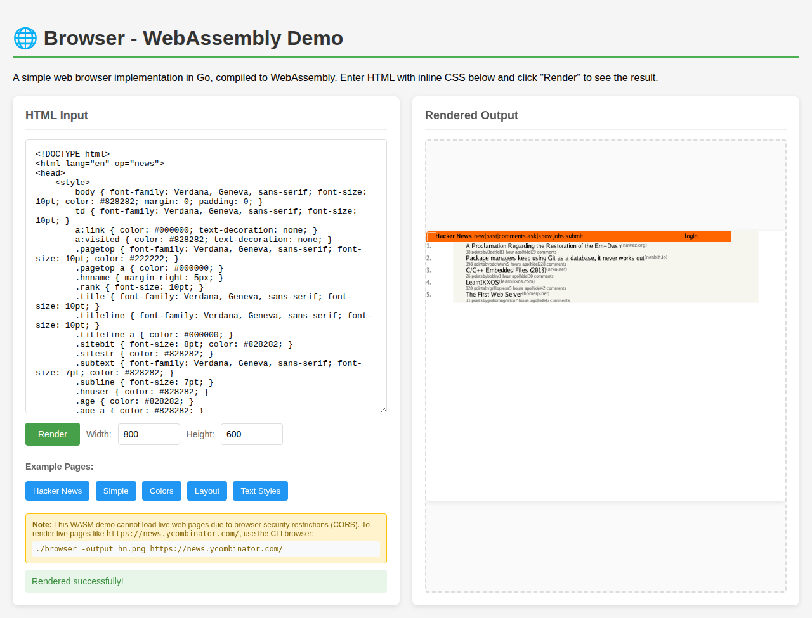
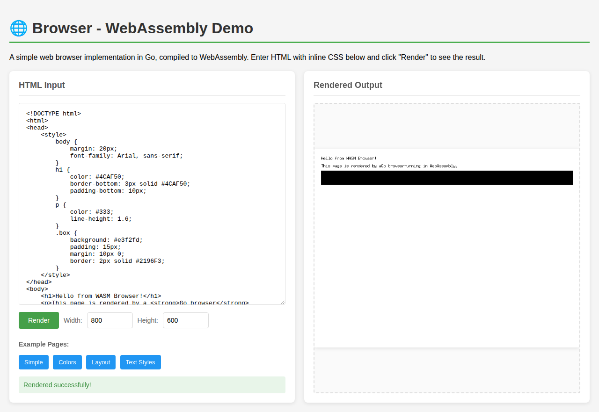

# Browser

[](https://github.com/lukehoban/browser/actions/workflows/ci.yml)
[](https://goreportcard.com/report/github.com/lukehoban/browser)

A web browser built from scratch in Go. Parses HTML and CSS, computes styles, performs layout, and renders pages to PNG -- or runs entirely in the browser via WebAssembly.

The implementation stays close to the W3C specifications and aims to provide a clean, readable codebase for anyone interested in how browsers work under the hood.

**[Live WebAssembly demo](https://lukehoban.github.io/browser/)**



## Features

- **HTML parsing** -- HTML5-compliant tokenizer and DOM tree construction
- **CSS parsing** -- CSS 2.1 syntax, selectors (element, class, ID, descendant), cascade and specificity
- **Style computation** -- selector matching, user-agent defaults, inline styles, shorthand expansion, inheritance
- **Layout engine** -- block and inline formatting, box model, table layout with auto-sizing
- **Rendering** -- text (bold, italic, underline, variable sizes), backgrounds, borders, images (PNG/JPEG/GIF/SVG)
- **Networking** -- HTTP/HTTPS page loading, external stylesheets via `<link>`, remote images
- **Data URLs** -- RFC 2397 inline resources (base64 and URL-encoded)
- **WebAssembly** -- full browser compiled to WASM, runs client-side with a live editor UI

## Quick Start

Requires Go 1.23+.

```bash
go build ./cmd/browser
```

```bash
# Render a local HTML file to PNG
./browser -output output.png test/styled.html

# Fetch and render a live web page
./browser -output hn.png https://news.ycombinator.com/

# Custom viewport size
./browser -output output.png -width 1024 -height 768 test/hackernews.html

# Print the layout tree (no rendering)
./browser test/styled.html

# Print the styled render tree
./browser -show-render test/styled.html
```

### CLI Flags

| Flag | Default | Description |
|------|---------|-------------|
| `-output` | _(none)_ | Output PNG path. Without this, the layout tree is printed to stdout. |
| `-width` | 800 | Viewport width in pixels |
| `-height` | 600 | Viewport height in pixels |
| `-show-layout` | false | Print the layout tree instead of rendering |
| `-show-render` | false | Print the render tree (styled nodes) instead of rendering |
| `-verbose` | false | Enable info-level logging |
| `-log-level` | warn | Log verbosity: `debug`, `info`, `warn`, `error` |

## Screenshots

### Hacker News


### Font Rendering

The browser uses the [Go fonts](https://blog.golang.org/go-fonts) -- proportional, sans-serif fonts embedded in the binary.


### Styled HTML


## WebAssembly

The browser compiles to WebAssembly and runs entirely client-side. A live demo is deployed automatically via GitHub Actions:

**https://lukehoban.github.io/browser/**



To build and serve locally:

```bash
GOOS=js GOARCH=wasm go build -o wasm/browser.wasm ./cmd/browser-wasm
cd wasm && python3 -m http.server 8080
```

See [wasm/README.md](wasm/README.md) for details.

## Testing

```bash
go test ./...
```

The test suite includes unit tests across all modules (90%+ coverage) and a [Web Platform Tests](https://web-platform-tests.org/) reftest harness:

```bash
go test -v ./reftest -run TestWPTCSSReftests
```

See [TESTING.md](TESTING.md) for the full testing strategy.

## Project Structure

```
browser/
├── cmd/
│   ├── browser/         # CLI application
│   ├── browser-wasm/    # WebAssembly entry point
│   └── wptrunner/       # WPT test runner
├── html/                # HTML tokenizer and parser
├── css/                 # CSS tokenizer, parser, and value handling
├── dom/                 # DOM tree, URL resolution, resource loading
├── style/               # Style computation, cascade, user-agent stylesheet
├── layout/              # Box model, block/inline/table layout
├── render/              # Rasterization and PNG output
├── font/                # Go font loading and text measurement
├── svg/                 # SVG parser and scanline rasterizer
├── log/                 # Leveled logging
├── reftest/             # WPT reftest harness
├── wasm/                # WebAssembly demo page
└── test/                # HTML fixtures and WPT test cases
```

## Specifications

The implementation follows these W3C specifications:

- [HTML5 &sect;12 -- Parsing](https://html.spec.whatwg.org/multipage/parsing.html)
- [CSS 2.1 &sect;4 -- Syntax](https://www.w3.org/TR/CSS21/syndata.html), [&sect;5 -- Selectors](https://www.w3.org/TR/CSS21/selector.html), [&sect;6 -- Cascade](https://www.w3.org/TR/CSS21/cascade.html), [&sect;8 -- Box Model](https://www.w3.org/TR/CSS21/box.html), [&sect;9 -- Visual Formatting](https://www.w3.org/TR/CSS21/visuren.html)
- [RFC 2397 -- The "data" URL Scheme](https://datatracker.ietf.org/doc/html/rfc2397)

## Documentation

- [MILESTONES.md](MILESTONES.md) -- Implementation milestones and progress
- [IMPLEMENTATION.md](IMPLEMENTATION.md) -- Architecture and design decisions
- [TESTING.md](TESTING.md) -- Testing strategy and WPT integration

## License

MIT
