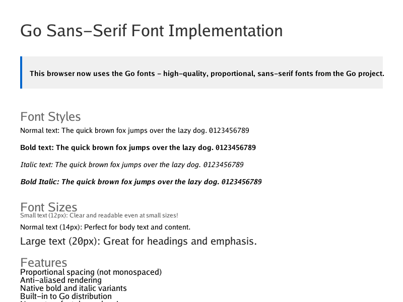
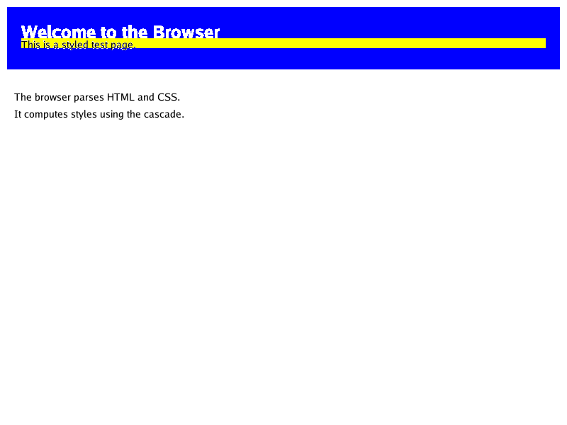
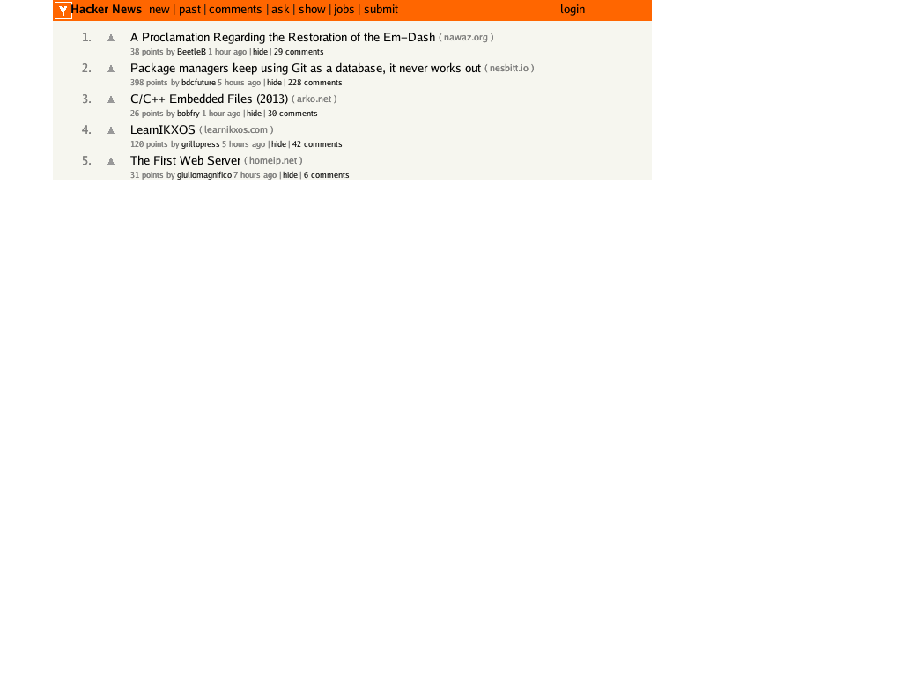

# Browser - A Simple Web Browser in Go :)

[](https://github.com/lukehoban/browser/actions/workflows/ci.yml)
[](https://goreportcard.com/report/github.com/lukehoban/browser)

A simple web browser implementation in Go, focusing on static HTML and CSS 2.1 compliance. This project aims to stay close to W3C specifications and provide a clean, well-organized codebase for educational purposes.

## Features

- HTML parsing with DOM tree construction
- CSS 2.1 parsing and style computation
- Visual formatting model (box model, block layout)
- **High-quality text rendering** with Go fonts (proportional sans-serif)
- Font styling support (bold, italic, underline, size)
- Image rendering (PNG, JPEG, GIF, SVG support)
- **Data URLs**: Support for RFC 2397 data URLs (base64 and URL-encoded)
- Background and border rendering
- PNG image output
- **Network support**: Load pages via HTTP/HTTPS
- **External CSS**: Fetch and apply stylesheets from `<link>` tags
- **Network images**: Load images from remote URLs
- **WebAssembly**: Run the browser entirely in a web client

## Architecture

The browser follows a classic rendering pipeline that transforms HTML and CSS into pixels:

```
┌─────────────────────────────────────────────────────────────────────────────────┐
│                              BROWSER ARCHITECTURE                               │
└─────────────────────────────────────────────────────────────────────────────────┘

    ┌──────────────┐
    │  HTML/URL    │ ─── Input: Local file or HTTP/HTTPS URL
    │   Input      │
    └──────┬───────┘
           │
           ▼
┌──────────────────────┐     ┌──────────────────────┐
│     HTML Parser      │     │     CSS Parser       │
│   ┌──────────────┐   │     │   ┌──────────────┐   │
│   │  Tokenizer   │   │     │   │  Tokenizer   │   │
│   │  (html/)     │   │     │   │  (css/)      │   │
│   └──────┬───────┘   │     │   └──────┬───────┘   │
│          ▼           │     │          ▼           │
│   ┌──────────────┐   │     │   ┌──────────────┐   │
│   │   Parser     │   │     │   │   Parser     │   │
│   └──────────────┘   │     │   └──────────────┘   │
└──────────┬───────────┘     └──────────┬───────────┘
           │                            │
           ▼                            ▼
    ┌──────────────┐             ┌──────────────┐
    │   DOM Tree   │             │  Stylesheet  │
    │   (dom/)     │             │   Rules      │
    └──────┬───────┘             └──────┬───────┘
           │                            │
           └─────────────┬──────────────┘
                         │
                         ▼
              ┌──────────────────────┐
              │   Style Computation  │
              │      (style/)        │
              │  ┌────────────────┐  │
              │  │ Selector Match │  │
              │  │ Specificity    │  │
              │  │ Cascade        │  │
              │  │ Inheritance    │  │
              │  └────────────────┘  │
              └──────────┬───────────┘
                         │
                         ▼
              ┌──────────────────────┐
              │     Styled Tree      │
              │ (DOM + Computed CSS) │
              └──────────┬───────────┘
                         │
                         ▼
              ┌──────────────────────┐
              │    Layout Engine     │
              │      (layout/)       │
              │  ┌────────────────┐  │
              │  │  Box Model     │  │
              │  │  Block Layout  │  │
              │  │  Inline Layout │  │
              │  │  Table Layout  │  │
              │  └────────────────┘  │
              └──────────┬───────────┘
                         │
                         ▼
              ┌──────────────────────┐
              │     Layout Tree      │
              │  (Positioned Boxes)  │
              └──────────┬───────────┘
                         │
                         ▼
              ┌──────────────────────┐
              │   Render Engine      │
              │      (render/)       │
              │  ┌────────────────┐  │
              │  │ Backgrounds    │  │
              │  │ Borders        │  │
              │  │ Text/Fonts     │  │
              │  │ Images (PNG,   │  │
              │  │  JPEG, GIF,    │  │
              │  │  SVG)          │  │
              │  └────────────────┘  │
              └──────────┬───────────┘
                         │
                         ▼
              ┌──────────────────────┐
              │     PNG Output       │
              │   (Pixel Buffer)     │
              └──────────────────────┘
```

### Data Flow

1. **Input**: HTML content is loaded from a local file or fetched via HTTP/HTTPS
2. **HTML Parsing**: Tokenizes HTML and builds a DOM tree structure
3. **CSS Parsing**: Extracts CSS from `<style>` tags and external stylesheets, parsing into rule sets
4. **Style Computation**: Matches CSS selectors to DOM elements, computes specificity, applies cascade
5. **Layout**: Calculates box dimensions and positions using the CSS box model
6. **Rendering**: Paints backgrounds, borders, text, and images to a pixel buffer
7. **Output**: Saves the rendered page as a PNG image

### Key Packages

| Package | Responsibility | Spec Reference |
|---------|---------------|----------------|
| `html/` | HTML tokenization & parsing | HTML5 §12 |
| `css/`  | CSS tokenization & parsing | CSS 2.1 §4 |
| `dom/`  | DOM tree structure & URL resolution | DOM Level 2 |
| `style/` | Selector matching, cascade, inheritance | CSS 2.1 §5-6 |
| `layout/` | Box model, visual formatting | CSS 2.1 §8-10 |
| `render/` | Painting, fonts, images | CSS 2.1 §14-16 |
| `svg/` | SVG parsing & rasterization | SVG 1.1 subset |

## Project Structure

```
browser/
├── cmd/
│   ├── browser/      # Main CLI browser application
│   └── browser-wasm/ # WebAssembly entry point
├── html/            # HTML tokenization and parsing
├── css/             # CSS parsing
├── dom/             # DOM tree structure
├── style/           # Style computation and cascade
├── layout/          # Layout engine (visual formatting model)
├── render/          # Rendering engine
├── wasm/            # WebAssembly demo page
└── test/            # Test files and fixtures
```

## Specifications

This browser implementation follows these W3C specifications:

- **HTML5**: Tokenization and parsing ([HTML5 §12](https://html.spec.whatwg.org/multipage/parsing.html))
- **CSS 2.1**: Syntax, selectors, cascade, box model, and visual formatting
  - [CSS 2.1 §4 Syntax](https://www.w3.org/TR/CSS21/syndata.html)
  - [CSS 2.1 §5 Selectors](https://www.w3.org/TR/CSS21/selector.html)
  - [CSS 2.1 §6 Cascade](https://www.w3.org/TR/CSS21/cascade.html)
  - [CSS 2.1 §8 Box Model](https://www.w3.org/TR/CSS21/box.html)
  - [CSS 2.1 §9 Visual Formatting Model](https://www.w3.org/TR/CSS21/visuren.html)
- **RFC 2397**: The "data" URL scheme for inline resources

## Quick Start

### Building

```bash
go build ./cmd/browser
```

### Running

```bash
# Render local HTML file to PNG
./browser -output output.png test/styled.html

# Load and render a web page from URL
./browser -output hn.png https://news.ycombinator.com/

# View layout tree without rendering (text output)
./browser test/styled.html

# Custom viewport size
./browser -output output.png -width 1024 -height 768 test/hackernews.html
```

## Screenshots

### Font Rendering

The browser uses the [Go fonts](https://blog.golang.org/go-fonts) - high-quality, proportional, sans-serif fonts designed for the Go project. These fonts are embedded in the binary and provide excellent readability with support for bold, italic, and various sizes.



### Test Case Rendering

Example of styled HTML with borders, colors, and text formatting:



### Hacker News

Latest Hacker News render (1024x768):



### Testing

```bash
go test ./...
```

## WebAssembly

The browser can be compiled to WebAssembly and run entirely in a web browser. A live demo is available at **https://lukehoban.github.io/browser/** and is automatically deployed via GitHub Actions.

To build locally:
```bash
GOOS=js GOARCH=wasm go build -o wasm/browser.wasm ./cmd/browser-wasm
cd wasm && python3 -m http.server 8080
```

See [wasm/README.md](wasm/README.md) for more details.

## Documentation

- **[MILESTONES.md](MILESTONES.md)** - Implementation milestones and progress tracking
- **[IMPLEMENTATION.md](IMPLEMENTATION.md)** - Detailed implementation summary and architecture
- **[TESTING.md](TESTING.md)** - Testing strategy and public test suite integration

## Current Status

✅ Milestones 1-7 Complete: Foundation, HTML Parsing, CSS Parsing, Style Computation, Layout Engine, Rendering, Image Rendering  
✅ Milestone 9 Complete: Network Support (HTTP/HTTPS, external CSS, remote images)  
✅ Milestone 9.5 Complete: Data URL Support (RFC 2397, base64 & URL-encoded inline resources)  
🔄 Milestone 8 In Progress: Testing & Validation (81.8% WPT pass rate)

See [MILESTONES.md](MILESTONES.md) for detailed progress and known limitations.

## License

MIT
