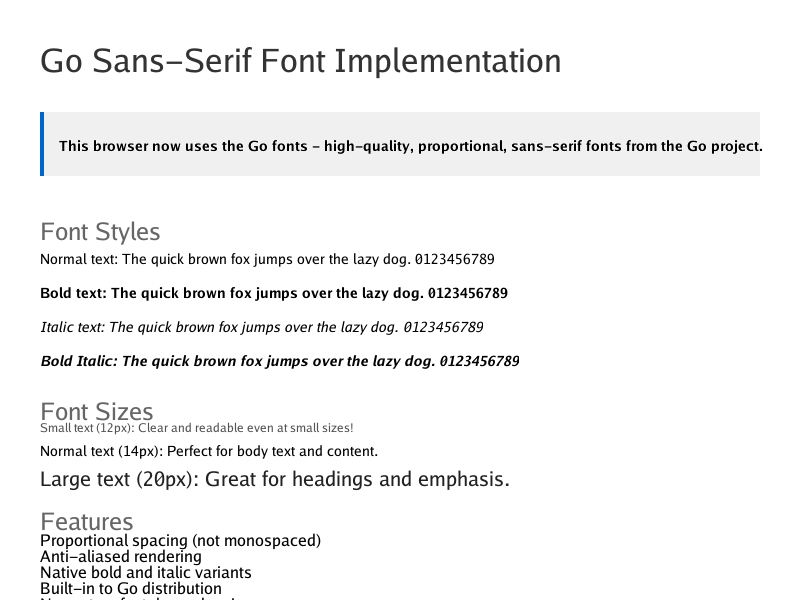
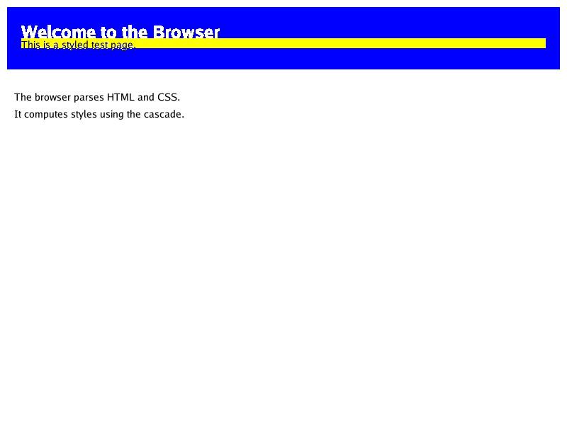
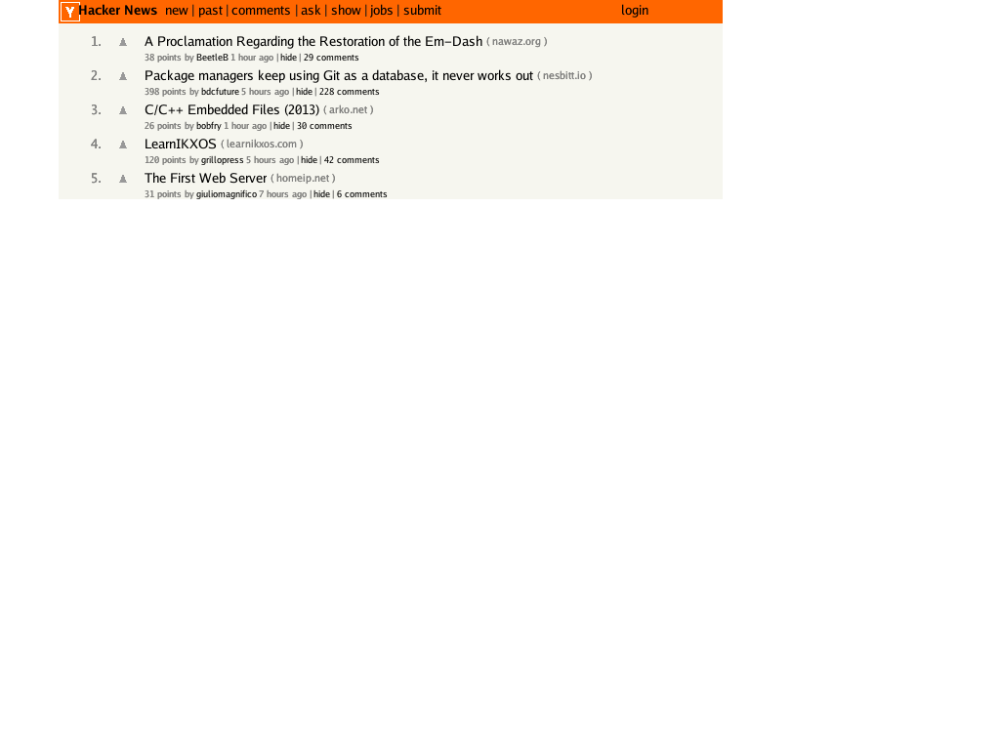

# Browser - A Simple Web Browser in Go :)

[](https://github.com/lukehoban/browser/actions/workflows/ci.yml)
[](https://goreportcard.com/report/github.com/lukehoban/browser)

A simple web browser implementation in Go, focusing on static HTML and CSS 2.1 compliance. This project aims to stay close to W3C specifications and provide a clean, well-organized codebase for educational purposes. It takes an HTML document (from a local file or a URL), parses it, computes styles and layout, and renders the result to a PNG image — no JavaScript execution.

## Features

- HTML parsing with DOM tree construction
- CSS 2.1 parsing and style computation
- Visual formatting model (box model, block layout, basic table layout)
- **High-quality text rendering** with Go fonts (proportional sans-serif)
- Font styling support (bold, italic, underline, size)
- Image rendering (PNG, JPEG, GIF, SVG support)
- **Data URLs**: Support for RFC 2397 data URLs (base64 and URL-encoded)
- Background and border rendering
- PNG image output
- **Network support**: Load pages via HTTP/HTTPS
- **External CSS**: Fetch and apply stylesheets from `<link>` tags
- **Network images**: Load images from remote URLs
- **WebAssembly**: Run the browser entirely in a web client

See [MILESTONES.md](MILESTONES.md) for the full, up-to-date list of implemented features and known limitations.

## Architecture

The browser follows a classic rendering pipeline, each stage owned by its own package:

```
HTML/CSS input → html/ (tokenize + parse) → dom/ (DOM tree)
               → css/ (tokenize + parse stylesheets)
               → style/ (selector matching + cascade)
               → layout/ (box model + visual formatting)
               → render/ (rasterize to canvas) → PNG output
```

See [IMPLEMENTATION.md](IMPLEMENTATION.md) for a detailed walkthrough of each stage and the design decisions behind it.

## Project Structure

```
browser/
├── cmd/
│   ├── browser/      # Main CLI browser application
│   ├── browser-wasm/ # WebAssembly entry point
│   └── wptrunner/    # Standalone runner for WPT-style reftests
├── html/            # HTML tokenization and parsing
├── css/             # CSS tokenization and parsing
├── dom/             # DOM tree structure and URL/resource loading
├── style/           # Style computation and cascade
├── layout/          # Layout engine (visual formatting model)
├── render/          # Rendering engine
├── svg/             # Minimal SVG parser/rasterizer (for background-image)
├── font/            # Embedded font handling
├── log/             # Leveled logging used to surface unimplemented features
├── reftest/         # WPT reference-test harness
├── wasm/            # WebAssembly demo page
└── test/            # Test files, fixtures, and WPT reftest cases
```

## Specifications

This browser implementation follows these W3C specifications:

- **HTML5**: Tokenization and parsing ([HTML5 §12](https://html.spec.whatwg.org/multipage/parsing.html))
- **CSS 2.1**: Syntax, selectors, cascade, box model, and visual formatting
  - [CSS 2.1 §4 Syntax](https://www.w3.org/TR/CSS21/syndata.html)
  - [CSS 2.1 §5 Selectors](https://www.w3.org/TR/CSS21/selector.html)
  - [CSS 2.1 §6 Cascade](https://www.w3.org/TR/CSS21/cascade.html)
  - [CSS 2.1 §8 Box Model](https://www.w3.org/TR/CSS21/box.html)
  - [CSS 2.1 §9 Visual Formatting Model](https://www.w3.org/TR/CSS21/visuren.html)
- **RFC 2397**: The "data" URL scheme for inline resources

## Prerequisites

- Go 1.23 or later (the module targets the version pinned in [go.mod](go.mod); CI builds with Go 1.23)

## Quick Start

### Building

```bash
go build ./cmd/browser
```

### Running

```bash
# Render local HTML file to PNG
./browser -output output.png test/styled.html

# Load and render a web page from URL
./browser -output hn.png https://news.ycombinator.com/

# View layout tree without rendering (text output)
./browser test/styled.html

# Custom viewport size
./browser -output output.png -width 1024 -height 768 test/hackernews.html
```

### Command-line Options

| Flag | Default | Description |
|------|---------|-------------|
| `-output` | *(none)* | Output PNG file path. If omitted, the layout tree is printed to stdout instead. |
| `-width` | `800` | Viewport width in pixels |
| `-height` | `600` | Viewport height in pixels |
| `-log-level` | `warn` | Log level: `debug`, `info`, `warn`, `error` |
| `-verbose` | `false` | Enable verbose logging (equivalent to `-log-level=info`) |
| `-show-layout` | `false` | Print the layout tree (boxes, dimensions, computed styles) instead of rendering |
| `-show-render` | `false` | Print the render tree (styled DOM nodes) instead of rendering |

Run `./browser -h` for the full, current list.

## Screenshots

### Font Rendering

The browser uses the [Go fonts](https://blog.golang.org/go-fonts) - high-quality, proportional, sans-serif fonts designed for the Go project. These fonts are embedded in the binary and provide excellent readability with support for bold, italic, and various sizes.



### Test Case Rendering

Example of styled HTML with borders, colors, and text formatting:



### Hacker News

Latest Hacker News render (1024x768):



## Testing

```bash
# Run all unit tests
go test ./...

# Run with coverage
go test -cover ./...

# Run the WPT (Web Platform Tests) CSS reftest suite
go test ./reftest/... -v
```

See [TESTING.md](TESTING.md) for the full testing strategy, current WPT pass rates, and how to add new reference tests.

## WebAssembly

The browser can be compiled to WebAssembly and run entirely in a web browser. A live demo is available at **https://lukehoban.github.io/browser/** and is automatically deployed via GitHub Actions.

To build locally:
```bash
GOOS=js GOARCH=wasm go build -o wasm/browser.wasm ./cmd/browser-wasm
cd wasm && python3 -m http.server 8080
```

Then open http://localhost:8080 in your browser. See [wasm/README.md](wasm/README.md) for more details, including WASM-specific limitations (no network loading, inline `<style>` CSS only).

## Documentation

- **[MILESTONES.md](MILESTONES.md)** - Implementation milestones and progress tracking
- **[IMPLEMENTATION.md](IMPLEMENTATION.md)** - Detailed implementation summary and architecture
- **[TESTING.md](TESTING.md)** - Testing strategy and public test suite integration

## Current Status

✅ Milestones 1-10 Complete: Foundation, HTML Parsing, CSS Parsing, Style Computation, Layout Engine, Rendering, Image Rendering, Testing & Validation, Network Support (HTTP/HTTPS, external CSS, remote images, data URLs), WebAssembly Support

See [MILESTONES.md](MILESTONES.md) for detailed progress and known limitations (e.g. no JavaScript, no positioning/floats/flexbox/grid, limited inline text layout).

## Contributing

This is primarily an educational project exploring browser internals, but contributions are welcome:

1. Check [MILESTONES.md](MILESTONES.md) for known limitations and planned work.
2. Add or update unit tests alongside any change (`go test ./...` must pass).
3. Keep [MILESTONES.md](MILESTONES.md) up to date when adding or changing features — it is the source of truth for project progress.
4. Run `go build -v ./...` and `go test -race ./...` locally before opening a PR; CI also runs `golangci-lint`.
5. For rendering/layout changes, consider attaching a before/after screenshot to your PR (see `.github/copilot-instructions.md`).

## License

[MIT](LICENSE)
